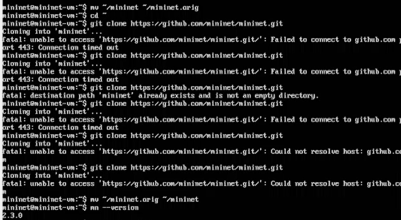
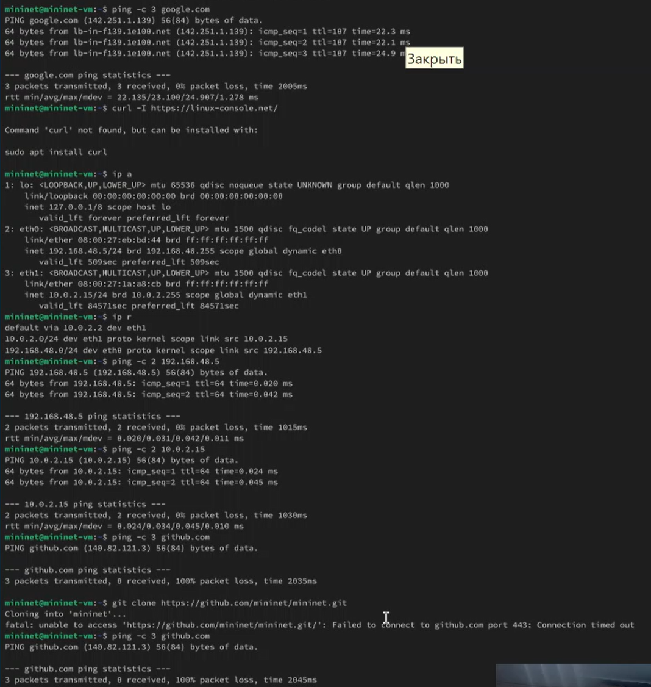
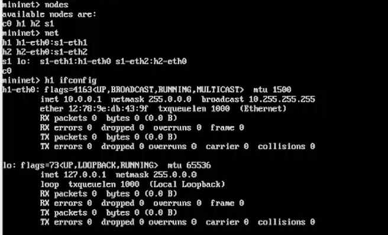
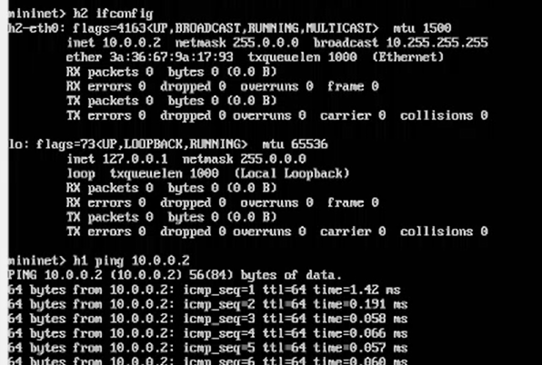
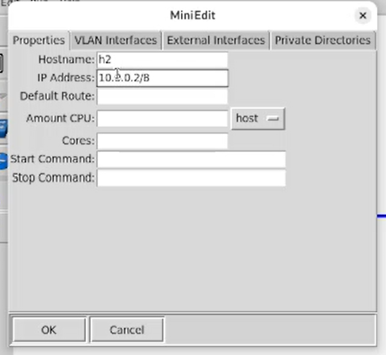
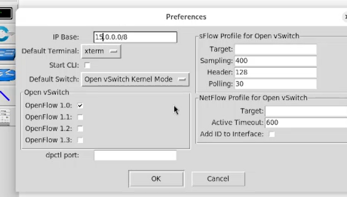
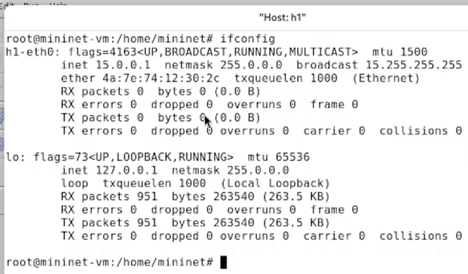

---
## Front matter
lang: ru-RU
title: Лабораторная работа № 1
subtitle: Введение в Mininet
author:
  - Доберштейн А. С.
institute:
  - Российский университет дружбы народов, Москва, Россия

## i18n babel
babel-lang: russian
babel-otherlangs: english

## Formatting pdf
toc: false
toc-title: Содержание
slide_level: 2
aspectratio: 169
section-titles: true
theme: metropolis
header-includes:
 - \usetheme{metropolis}
 - \usepackage{fontspec}
 - \usepackage{polyglossia}
 - \setdefaultlanguage{russian}
 - \setmainfont{FreeSerif}
 - \setsansfont{FreeSerif}
 - \setmonofont{FreeSerif}
 - \usepackage{amsmath}
 - \usepackage{amssymb}
---

# Информация

## Докладчик

:::::::::::::: {.columns align=center}
::: {.column width="70%"}

  * Доберштейн Алина Сергеевна
  * НФИбд-02-22
  * Российский университет дружбы народов
  * [1132226448@pfur.ru](mailto:1132226448@pfur.ru)

:::

::::::::::::::

## Цель работы

Основной целью работы является развёртывание в системе виртуализации (например,в VirtualBox) mininet, знакомство с основными командами для работы с Mininet через командную строку и через графический интерфейс.

## Задание

1. Настройка стенда виртуальной машины Mininet
2. Основы работы с Mininet

## Настройка образа VirtualBox

{#fig:001 width=50%}

## Подключение к виртуальной машине

{#fig:002 width=50%}

## Настройка доступа к Интернет

Посмотрела IP-адреса машины.

{#fig:003 width=70%}

## Настройка доступа к Интернет

Активировала второй интерфейс командой `sudo dhclient eth1`.

{#fig:004 width=70%}

## Настройка доступа к Интернет

Добавила для mininet указание на использование двух адаптеров при запуске.

{#fig:005 width=70%}

## Обновление версии Minninet

{#fig:006 width=70%}

## Обновление версии Minninet
 
{#fig:007 width=70%}

## Настройка параметров XTerm

Для увеличения размера шрифта и применения векторных шрифтов внесла изменения в файл

{#fig:008 width=70%}

## Настройка соединения X11 для суперпользователя

{#fig:009 width=70%}

## Работа с Mininet с помощью командной строки

{#fig:010 width=70%}

## Работа с Mininet с помощью командной строки

Отобразили доступные узлы, посмотрели доступные линки и интерфейсы хоста h1.

{#fig:011 width=70%}

## Работа с Mininet с помощью командной строки

И интерфейсы хоста h2. Затем проверила связь между хостами командой `ping`. 

{#fig:012 width=70%}

## Построение и эмуляция сети в Mininet с использованием графического интерфейса

{#fig:013 width=70%}

## Построение и эмуляция сети в Mininet с использованием графического интерфейса

{#fig:014 width=70%}

## Построение и эмуляция сети в Mininet с использованием графического интерфейса

{#fig:015 width=70%}

## Построение и эмуляция сети в Mininet с использованием графического интерфейса

{#fig:016 width=70%}

## Построение и эмуляция сети в Mininet с использованием графического интерфейса

{#fig:017 width=70%}

## Построение и эмуляция сети в Mininet с использованием графического интерфейса

Создала каталог для работы с проектами mininet, после сохранения проекта поменяла права доступа к файлам в каталоге проекта.

{#fig:018 width=70%}

## Выводы

В ходе выполнения лабораторной работы я развернула в системе виртуализации VirtualBox mininet, познакомилась с основными командами для работы с Mininet через командную строку и через графический интерфейс.