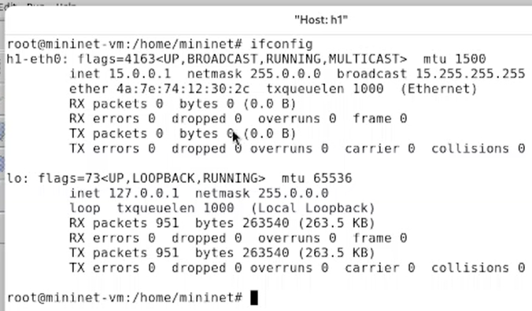
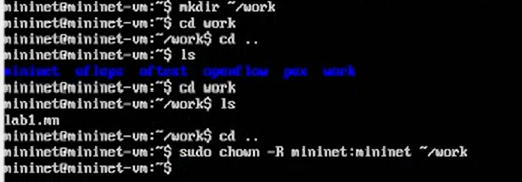

---
## Front matter
title: "Лабораторная работа № 1"
subtitle: "Моделирование сетей передачи данных"
author: "Доберштейн Алина Сергеевна"

## Generic otions
lang: ru-RU
toc-title: "Содержание"

## Bibliography
bibliography: bib/cite.bib
csl: pandoc/csl/gost-r-7-0-5-2008-numeric.csl

## Pdf output format
toc: true # Table of contents
toc-depth: 2
lof: true # List of figures
lot: false # List of tables
fontsize: 12pt
linestretch: 1.5
papersize: a4
documentclass: scrreprt
## I18n polyglossia
polyglossia-lang:
  name: russian
  options:
	- spelling=modern
	- babelshorthands=true
polyglossia-otherlangs:
  name: english
## I18n babel
babel-lang: russian
babel-otherlangs: english
## Fonts
mainfont: FreeSerif
romanfont: FreeSerif
sansfont: FreeSerif
monofont: FreeSerif
mainfontoptions: Ligatures=Common,Ligatures=TeX,Scale=0.94
romanfontoptions: Ligatures=Common,Ligatures=TeX,Scale=0.94
sansfontoptions: Ligatures=Common,Ligatures=TeX,Scale=MatchLowercase,Scale=0.94
monofontoptions: Scale=MatchLowercase,Scale=0.94,FakeStretch=0.9
mathfontoptions:
## Biblatex
biblatex: true
biblio-style: "gost-numeric"
biblatexoptions:
  - parentracker=true
  - backend=biber
  - hyperref=auto
  - language=auto
  - autolang=other*
  - citestyle=gost-numeric
## Pandoc-crossref LaTeX customization
figureTitle: "Рис."
tableTitle: "Таблица"
listingTitle: "Листинг"
lofTitle: "Список иллюстраций"
lotTitle: "Список таблиц"
lolTitle: "Листинги"
## Misc options
indent: true
header-includes:
  - \usepackage{indentfirst}
  - \usepackage{float} # keep figures where there are in the text
  - \floatplacement{figure}{H} # keep figures where there are in the text
---

# Цель работы

Основной целью работы является развёртывание в системе виртуализации (например,в VirtualBox) mininet, знакомство с основными командами для работы с Mininet через командную строку и через графический интерфейс.

# Задание

1. Настройка стенда виртуальной машины Mininet
2. Основы работы с Mininet

# Теоретическое введение

Mininet (http://mininet.org/) — это виртуальная среда, которая позволяет разрабатывать и тестировать сетевые инструменты и протоколы. В сетях Mininet работают реальные сетевые приложения Unix/Linux, а также реальное ядро Linux и сетевой стек.

# Выполнение лабораторной работы

## Настройка стенда виртуальной машины Mininet

### Настройка образа VirtualBox

Скачайла актуальный релиз ovf-образа виртуальной машины из репозитория. Переместила скачанный образ в каталог для работы и затем распаковала его. Запустила систему виртуализации и импортировала файл .ovf. (рис. [-@fig:001]).

{#fig:001 width=70%}

Перейшла в настройки системы виртуализации и уточнила параметры настройки виртуальной машины. Запустила виртуальную машину Mininet.

### Подключение к виртуальной машине

Залогинилась в виртуальной машине, посмотрела адрес с помощью команды `ifconfig`. Подключилась из терминала хостовой машины по ssh и настроила соединение по ключу, чтобы подсоединяться далее без ввода пароля.(рис. [-@fig:002]).

{#fig:002 width=70%}

### Настройка доступа к Интернет

Посмотрела IP-адреса машины.(рис. [-@fig:003]).

{#fig:003 width=70%}

Активировала второй интерфейс командой `sudo dhclient eth1`.(рис. [-@fig:004]).

{#fig:004 width=70%}

Установила mc, добавила для mininet указание на использование двух адаптеров при запуске. (рис. [-@fig:005]).

{#fig:005 width=70%}

### Обновление версии Minninet

В терминале сначала переименовали предыдущую установку mininet, затем необходимо было скачать новую версию с гитхаба. (рис. [-@fig:006]).

{#fig:006 width=70%}

Спустя множество попыток и всевозможных пингов я выяснила, что у меня есть доступ ко всему Интернету, кроме github. (рис. [-@fig:007]). Поэтому я переименовала обратно старую установку. К счастью, это никак не повлияло на функционал, так как я уже успешно выполнила все 6 лабораторных работ этого курса. Далее я поняла, что wifi сеть общежитий и университета просто не пускает на github даже с vpn. Поэтому, когда в следующей лабораторной мне нужно было установить ПО с гитхаба, мне успешно это удалось, так как я случайно подключилась к Moscow-Free wifi сети, которая до этого не работала.

{#fig:007 width=70%}

### Настройка параметров XTerm

Для увеличения размера шрифта и применения векторных шрифтов внесла изменения в файл /etc/X11/app-defaults/XTerm.(рис. [-@fig:008]).

{#fig:008 width=70%}

### Настройка соединения X11 для суперпользователя

Скопировала значение куки пользователя mininet в файл для пользователя root. (рис. [-@fig:009]).

{#fig:009 width=70%}

## Основы работы в Mininet

### Работа с Mininet с помощью командной строки

Для запуска минимальной топологии ввела `sudo mn`. (рис. [-@fig:010]).

{#fig:010 width=70%}

Отобразили доступные узлы, посмотрели доступные линки и интерфейсы хоста h1. (рис. [-@fig:011]).

{#fig:011 width=70%}

И интерфейсы хоста h2. Затем проверила связь между хостами командой `ping`. (рис. [-@fig:012]).

{#fig:012 width=70%}

Остановила симуляцию.

### Построение и эмуляция сети в Mininet с использованием графического интерфейса

В терминале запустила MiniEdit с помощью команды `sudo ~/mininet/mininet/examples/miniedit.py`. Добавила два хоста и коммутатор, соединила узлы. (рис. [-@fig:013]).

{#fig:013 width=70%}

Настроила IP-адреса на хостах h1 и h2. (рис. [-@fig:014]).

{#fig:014 width=70%}

Проверила связь между хостами. (рис. [-@fig:015]).

{#fig:015 width=70%}

Настроила автоматическое назначение IP-адресов. (рис. [-@fig:016]).

{#fig:016 width=70%}

Проверила адреса на хостах. (рис. [-@fig:017]).

{#fig:017 width=70%}

Создала каталог для работы с проектами mininet, после сохранения проекта поменяла права доступа к файлам в каталоге проекта. (рис. [-@fig:018]).

{#fig:018 width=70%}

# Выводы

В ходе выполнения лабораторной работы я развернула в системе виртуализации VirtualBox mininet, познакомилась с основными командами для работы с Mininet через командную строку и через графический интерфейс.

# Список литературы{.unnumbered}

::: {#refs}
:::
