---
## Front matter
lang: ru-RU
title: Лабораторная работа № 2
subtitle: Измерение и тестирование пропускной способноти сети. Интерактивнф  эксперимент
author:
  - Доберштейн А. С.
institute:
  - Российский университет дружбы народов, Москва, Россия

## i18n babel
babel-lang: russian
babel-otherlangs: english

## Formatting pdf
toc: false
toc-title: Содержание
slide_level: 2
aspectratio: 169
section-titles: true
theme: metropolis
header-includes:
 - \usetheme{metropolis}
 - \usepackage{fontspec}
 - \usepackage{polyglossia}
 - \setdefaultlanguage{russian}
 - \setmainfont{FreeSerif}
 - \setsansfont{FreeSerif}
 - \setmonofont{FreeSerif}
 - \usepackage{amsmath}
 - \usepackage{amssymb}
---

# Информация

## Докладчик

:::::::::::::: {.columns align=center}
::: {.column width="70%"}

  * Доберштейн Алина Сергеевна
  * НФИбд-02-22
  * Российский университет дружбы народов
  * [1132226448@pfur.ru](mailto:1132226448@pfur.ru)

:::

::::::::::::::

## Цель работы

Основной целью работы является знакомство с инструментом для измерения пропускной способности сети в режиме реального времени —iPerf3, а также получение навыков проведения интерактивного эксперимента по измерению пропускной способности моделируемой сети в среде Mininet.

## Задание

1. Установить на виртуальную машину mininet iPerf3 и дополнительное программное обеспечениядля визуализации и обработки данных.
2. Провести ряд интерактивных экспериментов по измерению пропускной способности с помощью iPerf3 с построением графиков.

## Выполнение лабораторной работы

### Установка необходимого программного обеспечения

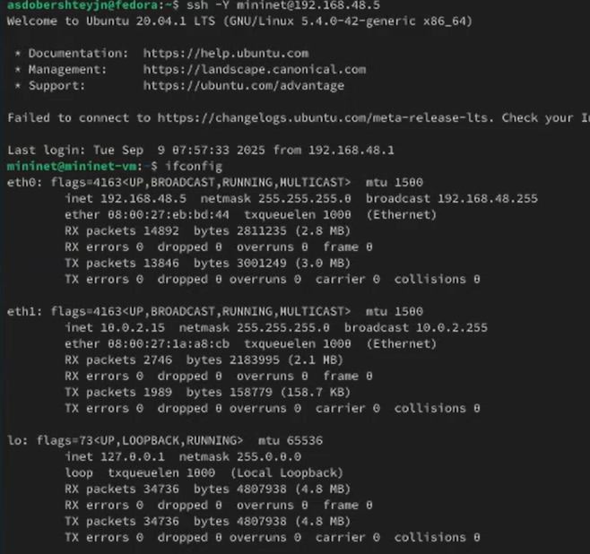{#fig:001 width=70%}

## Установка необходимого программного обеспечения

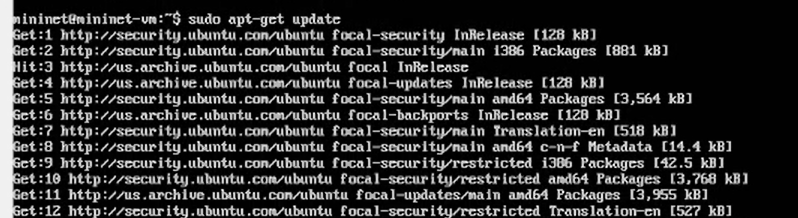{#fig:002 width=70%}

## Установка необходимого программного обеспечения

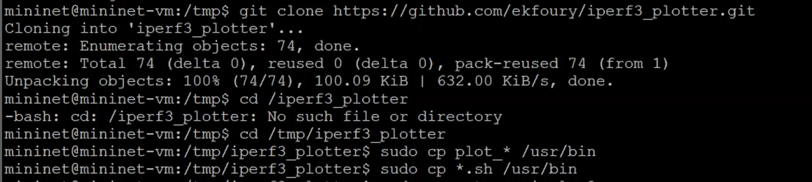{#fig:003 width=70%}

## Интерактивные эксперименты

Запустила простейшую топологию с двумя хостами и коммутатором.

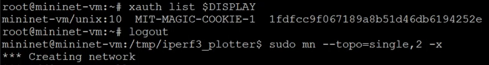{#fig:004 width=70%}

## Интерактивные эксперименты

Посмотрела параметры запущенной в интерактивном режиме топологии.

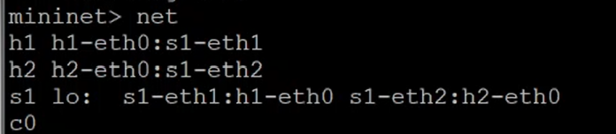{#fig:005 width=70%}

## Интерактивные эксперименты

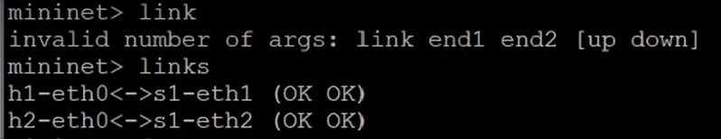{#fig:006 width=70%}

## Интерактивные эксперименты

В терминале h2 запустила сервер iperf3, после запуска в терминале хоста h1 запустила клиент iperf3.

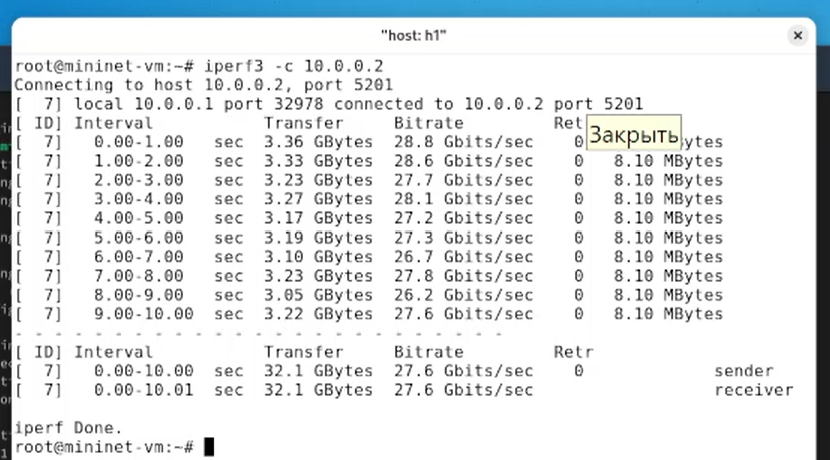{#fig:007 width=70%}

## Интерактивные эксперименты

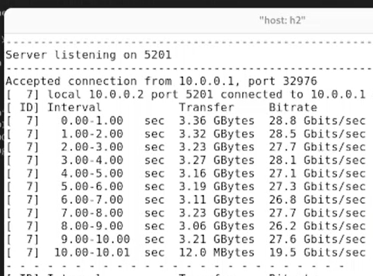{#fig:008 width=70%}

## Интерактивные эксперименты

Провела аналогичный эксперимент в интерфейсе iperf3.

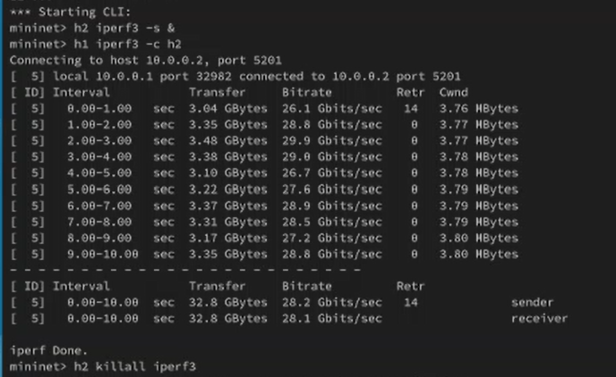{#fig:009 width=70%}

## Интерактивные эксперименты

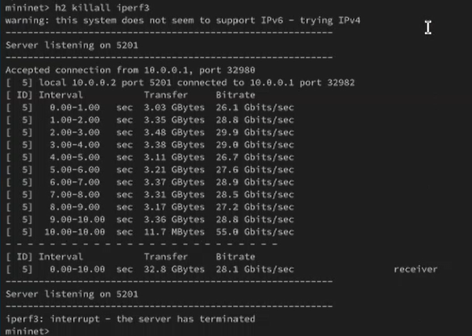{#fig:010 width=70%}

## Интерактивные эксперименты

Далее провела интерактивный эксперимент с измененным временем передачи (по умолчанию - 10 секунд, параметр -t).

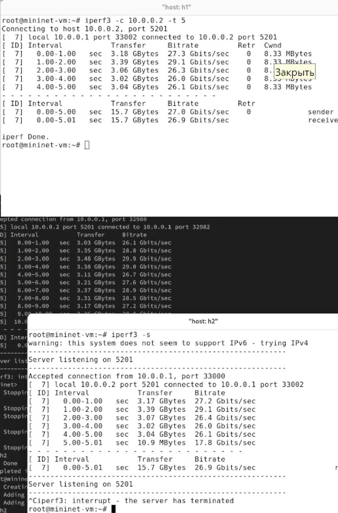{#fig:011 width=70%}

## Интерактивные эксперименты

Далее провела интерактивный эксперимент с 2-секундным интервалом времени отсчёта как на клиенте, так и на сервере.

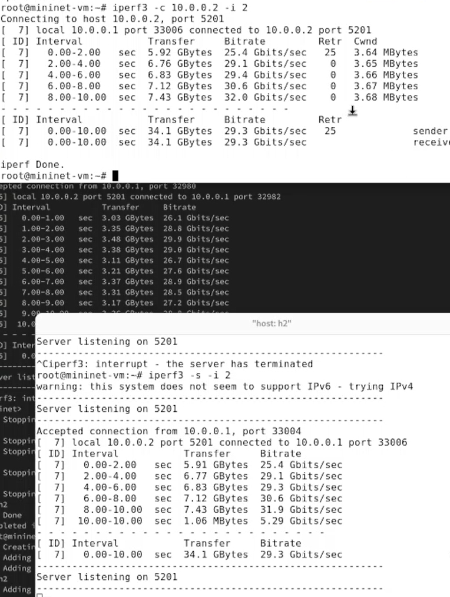{#fig:012 width=70%}

## Интерактивные эксперименты

Далее провела интерактивный эксперимент с изменением объема отправляемых данных(Transfer, 16 Гбайт).

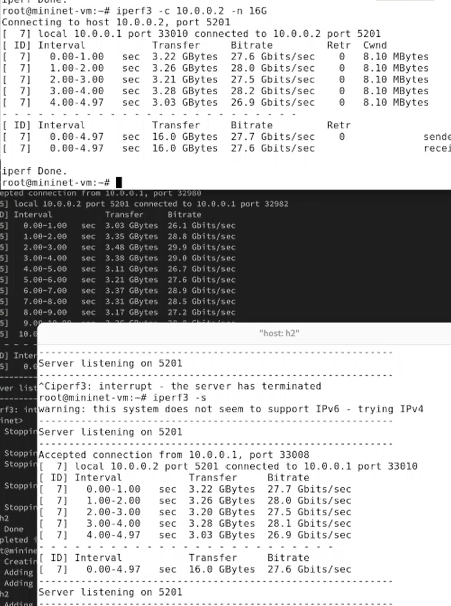{#fig:013 width=70%}

## Интерактивные эксперименты

Далее провела интерактивный эксперимент с изменением протокола передачи данных с TCP на UDP.

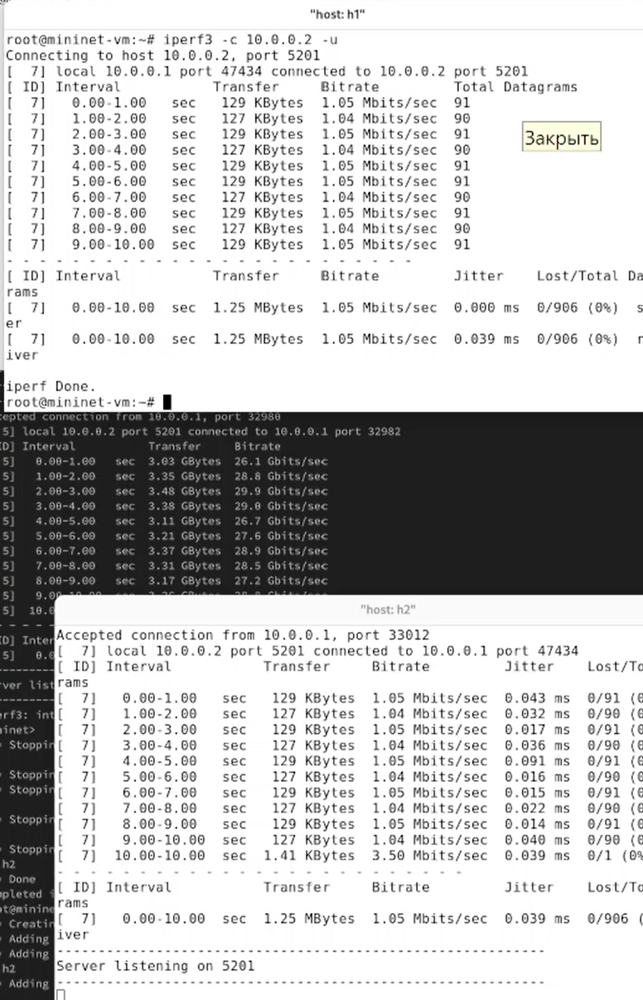{#fig:014 width=70%}

## Интерактивные эксперименты

Далее провела интерактивный эксперимент с изменением порта для отаправки и получения пакетов или датаграмм.

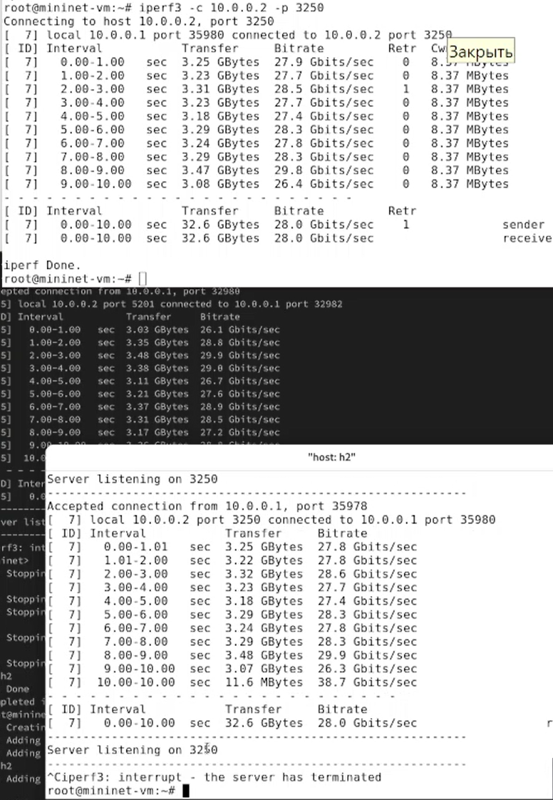{#fig:015 width=70%}

## Интерактивные эксперименты

Далее провела интерактивный эксперимент с изменением параметра обработки данных (только от одного клиента с остановкой сервера по завершении теста).

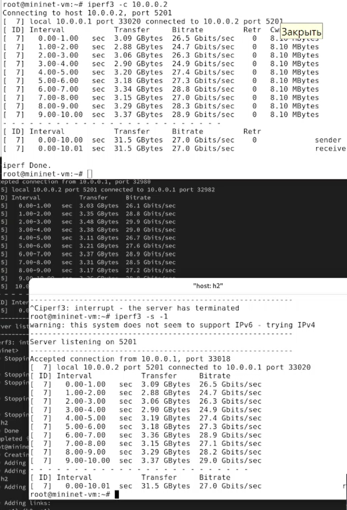{#fig:016 width=70%}

## Интерактивные эксперименты

Экспортировала вывод результатов теста в формате JSON в файл, перенаправив стандартный вывод в файл.

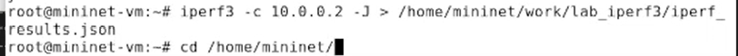{#fig:017 width=70%}

## Интерактивные эксперименты

Перешла в каталог для работы над проектом и скорректировала права доступа к файлу JSON.

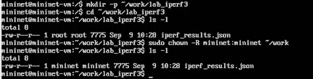{#fig:018 width=70%}

## Интерактивные эксперименты

Сгенерировала выходные данные для файла JSON, выполнив команду `plot_iperf.sh iperf3_results.json`. Убедилась, что файлы с данными и графиками сформировались.

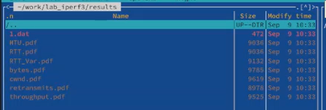{#fig:019 width=70%}

## Выводы

В ходе выполнения лабораторной работы я познакомилась с инструментом для измерения пропускной способности сети в режиме реального времени —iPerf3, а также получила навыки проведения интерактивного эксперимента по измерению пропускной способности моделируемой сети в среде Mininet.