---
## Front matter
title: "Лабораторная работа № 2"
subtitle: "Моделирование сетей передачи данных"
author: "Доберштейн Алина Сергеевна"

## Generic otions
lang: ru-RU
toc-title: "Содержание"

## Bibliography
bibliography: bib/cite.bib
csl: pandoc/csl/gost-r-7-0-5-2008-numeric.csl

## Pdf output format
toc: true # Table of contents
toc-depth: 2
lof: true # List of figures
lot: false # List of tables
fontsize: 12pt
linestretch: 1.5
papersize: a4
documentclass: scrreprt
## I18n polyglossia
polyglossia-lang:
  name: russian
  options:
  - spelling=modern
  - babelshorthands=true
polyglossia-otherlangs:
  name: english
## I18n babel
babel-lang: russian
babel-otherlangs: english
## Fonts
mainfont: FreeSerif
romanfont: FreeSerif
sansfont: FreeSerif
monofont: FreeSerif
mainfontoptions: Ligatures=Common,Ligatures=TeX,Scale=0.94
romanfontoptions: Ligatures=Common,Ligatures=TeX,Scale=0.94
sansfontoptions: Ligatures=Common,Ligatures=TeX,Scale=MatchLowercase,Scale=0.94
monofontoptions: Scale=MatchLowercase,Scale=0.94,FakeStretch=0.9
mathfontoptions:
## Biblatex
biblatex: true
biblio-style: "gost-numeric"
biblatexoptions:
  - parentracker=true
  - backend=biber
  - hyperref=auto
  - language=auto
  - autolang=other*
  - citestyle=gost-numeric
## Pandoc-crossref LaTeX customization
figureTitle: "Рис."
tableTitle: "Таблица"
listingTitle: "Листинг"
lofTitle: "Список иллюстраций"
lotTitle: "Список таблиц"
lolTitle: "Листинги"
## Misc options
indent: true
header-includes:
  - \usepackage{indentfirst}
  - \usepackage{float} # keep figures where there are in the text
  - \floatplacement{figure}{H} # keep figures where there are in the text
---

# Цель работы

Основной целью работы является знакомство с инструментом для измерения пропускной способности сети в режиме реального времени —iPerf3, а также получение навыков проведения интерактивного эксперимента по измерению пропускной способности моделируемой сети в среде Mininet.

# Задание

1. Установить на виртуальную машину mininet iPerf3 и дополнительное программное обеспечениядля визуализации и обработки данных.
2. Провести ряд интерактивных экспериментов по измерению пропускной способности с помощью iPerf3 с построением графиков.

# Теоретическое введение

В контексте сеанса связи между двумя конечными устройствами на сетевом пути под пропускной способностью (throughput) понимается скорость в битах в секунду,с которой процесс-отправитель может доставлять данные процессу получателю. В тоже время под полосой пропускания (Bandwidth) понимается физическое свойство среды передачи данных, зависящее, например, от конструкции и длины провода или волокна. Иногда термины «пропускная способность» (throughput) и «полоса пропускания» (bandwidth) используются взаимозаменяемо.
iPerf3 представляет собой кроссплатформенное клиент-серверное приложение с открытым исходным кодом, которое можно использовать для измерения пропускной способности между двумя конечнымиустройствами.

# Выполнение лабораторной работы

## Установка необходимого программного обеспечения

Запустила виртуальную машину mininet, из основной ОС подключилась к miniet по ssh. Затем посмотрела IP-адреса машины. (рис. [-@fig:001]).

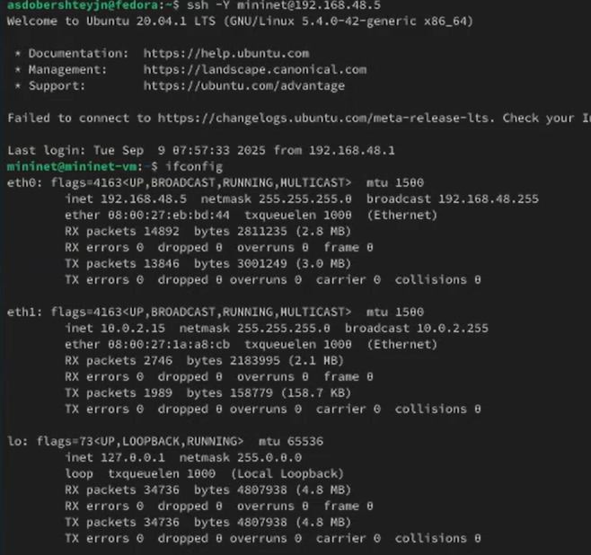{#fig:001 width=70%}

Обновила репозитории программного обеспечения на виртуальной машине (рис. [-@fig:002]).

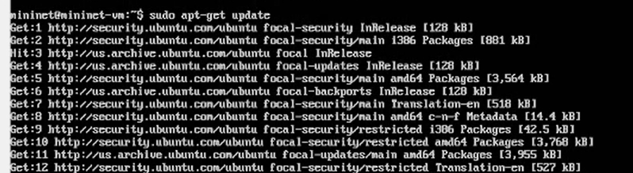{#fig:002 width=70%}

Установила iperf3 (рис. [-@fig:003]).

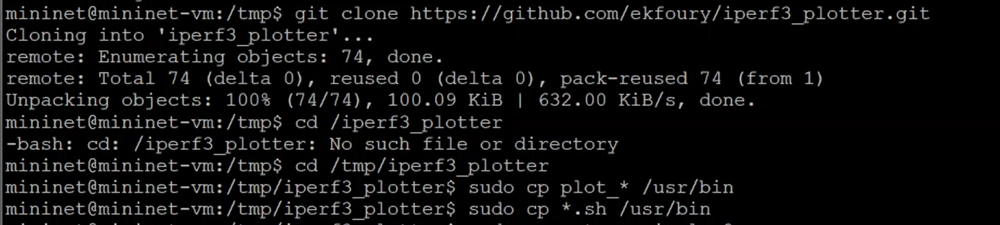{#fig:003 width=70%}

## Интерактивные эксперименты

Запустила простейшую топологию с двумя хостами и коммутатором (рис. [-@fig:004]).

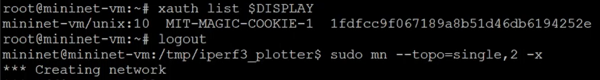{#fig:004 width=70%}

Посмотрела параметры запущенной в интерактивном режиме топологии (рис. [-@fig:005]-[-@fig:006]).

{#fig:005 width=70%}

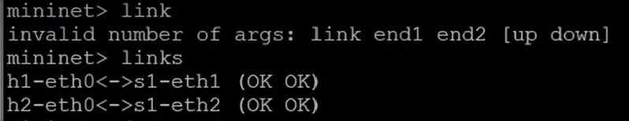{#fig:006 width=70%}

В терминале h2 запустила сервер iperf3, после запуска в терминале хоста h1 запустила клиент iperf3. (рис. [-@fig:007]-[-@fig:008]).

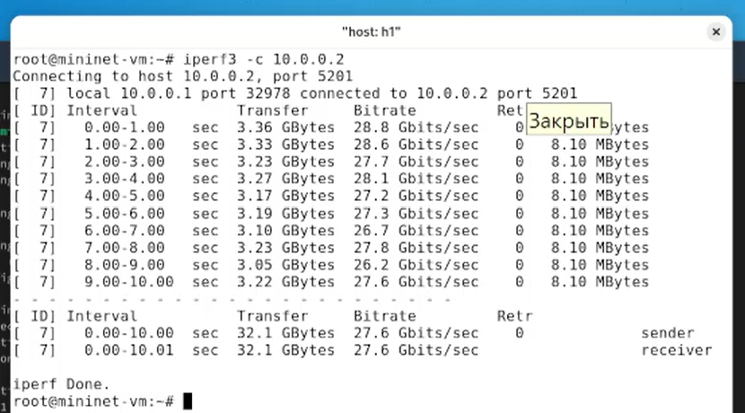{#fig:007 width=70%}

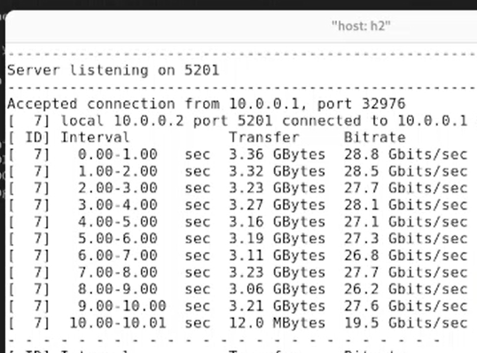{#fig:008 width=70%}

В результате выполнения теста получили сводный отчёт,отобразившийся как на клиенте, так и на сервере iPerf3, содержащий следующие данные:
– ID: идентификационный номер соединения.
– интервал (Interval): временной интервал для периодических отчетов о пропускной способности (по умолчанию временной интервал равен 1 секунде);
– передача (Transfer): сколько данных было передано за каждый интервал времени;
– пропускная способность (Bitrate): измеренная пропускная способность в каждом временном интервале;
– Retr: количество повторно переданных TCP-сегментов за каждый временной интервал (это поле увеличивается,когда TCP-сегменты теряются в сети из-за перегрузки или повреждения);
– Cwnd: указывает размер окна перегрузки в каждом временном интервале (TCP использует эту переменную для ограничения объёма данных, которые TCP-клиент может отправить до получения подтверждения отправленных данных).
Суммарные данные на сервере аналогичны данным на стороне клиента iPerf3 и должны интерпретироваться таким же образом.

Провела аналогичный эксперимент в интерфейсе iperf3: запустила сервер на h2 и клиент на h1. После завершения остановила серверный процесс. (рис. [-@fig:009]-[-@fig:010]).

{#fig:009 width=70%}

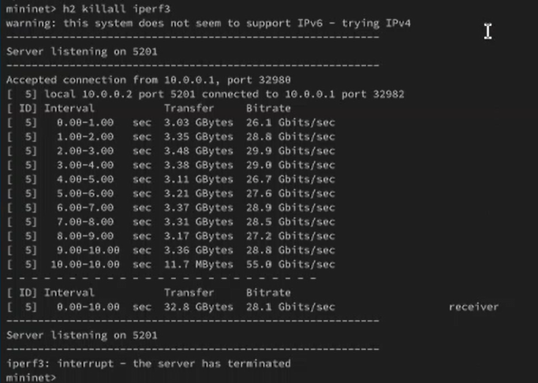{#fig:010 width=70%}

В первом случае был больше объем передаваемых данных (Cwnd), во втором случае на один временной интервал меньше.

Далее провела интерактивный эксперимент с измененным временем передачи (по умолчанию - 10 секунд, параметр -t)(рис. [-@fig:011]).

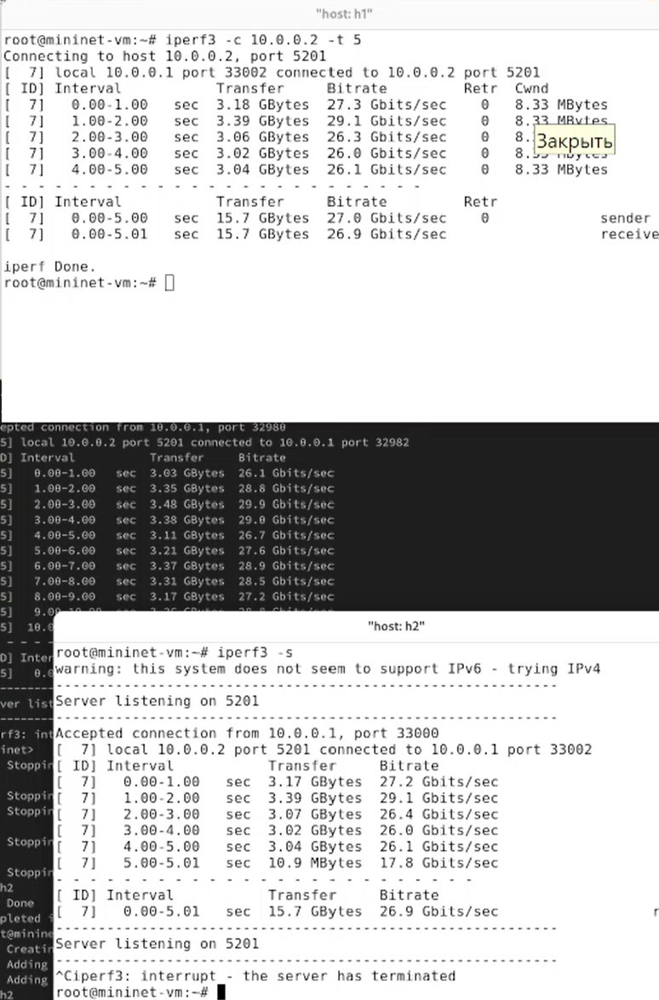{#fig:011 width=70%}

Далее провела интерактивный эксперимент с 2-секундным интервалом времени отсчёта как на клиенте, так и на сервере.(рис. [-@fig:012]).

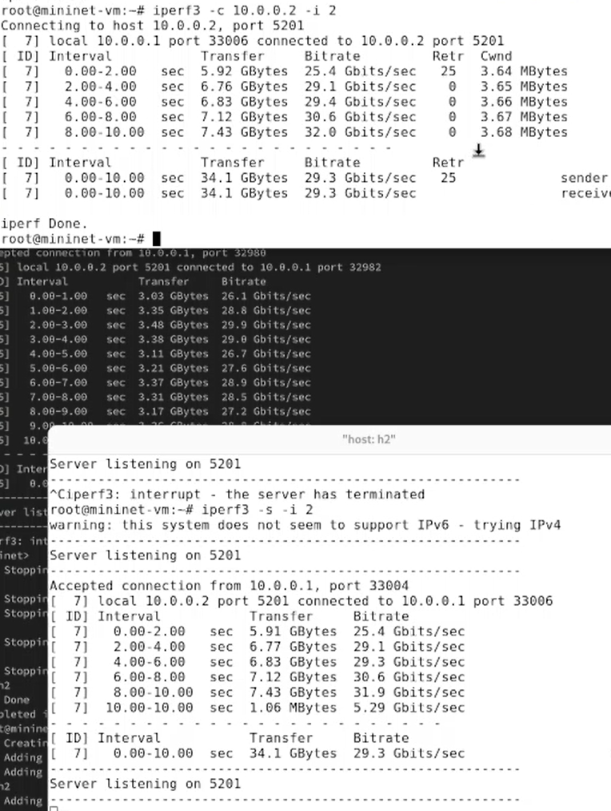{#fig:012 width=70%}

Далее провела интерактивный эксперимент с изменением объема отправляемых данных(Transfer, 16 Гбайт).(рис. [-@fig:013]).

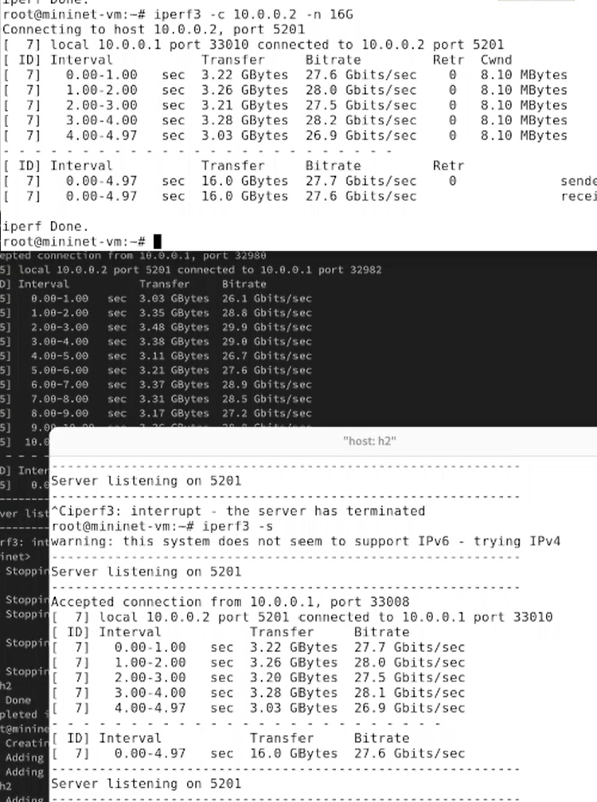{#fig:013 width=70%}

Далее провела интерактивный эксперимент с изменением протокола передачи данных с TCP на UDP.(рис. [-@fig:014]).

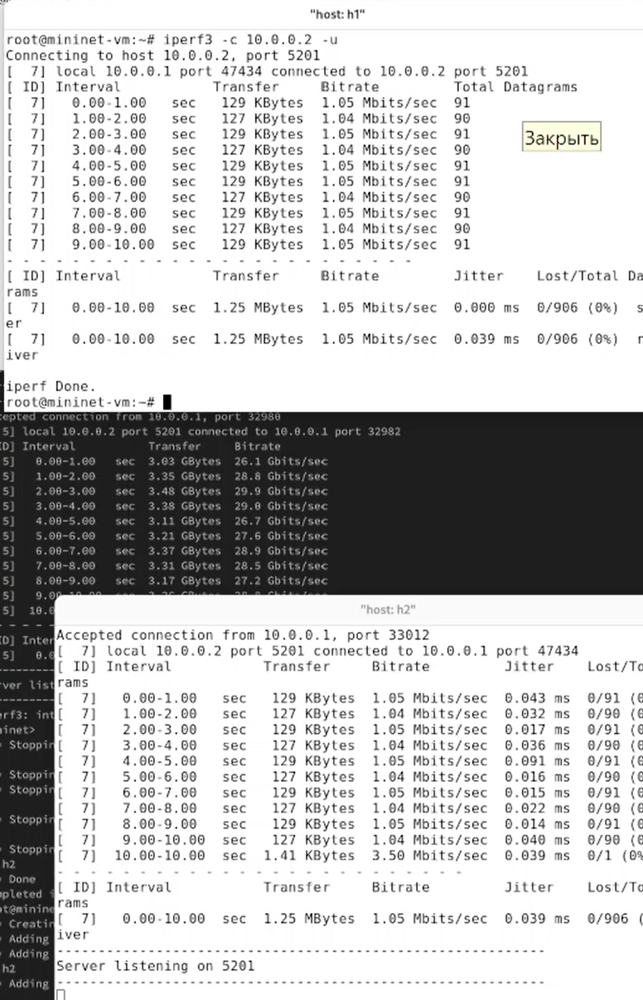{#fig:014 width=70%}

Послезавершения теста отобразились следующие сводные данные:
– ID, интервал, передача, битрейт: то же,что и у TCP.
– Jitter: разница в задержке пакетов.
– Lost/Total: указывает количество потерянных дейтаграмм по сравнению с общим количеством отправленных на сервер (и процентное соотношение).

Далее провела интерактивный эксперимент с изменением порта для отаправки и получения пакетов или датаграмм.(рис. [-@fig:015]).

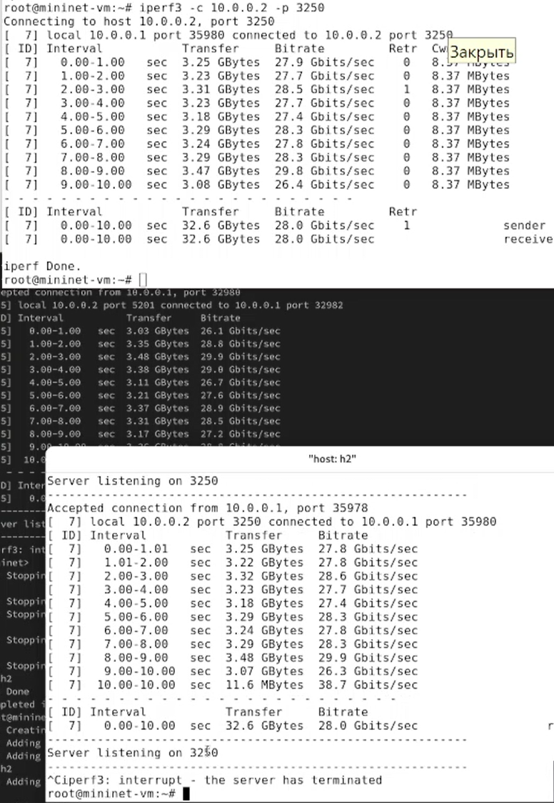{#fig:015 width=70%}

Далее провела интерактивный эксперимент с изменением параметра обработки данных (только от одного клиента с остановкой сервера по завершении теста).(рис. [-@fig:016]).

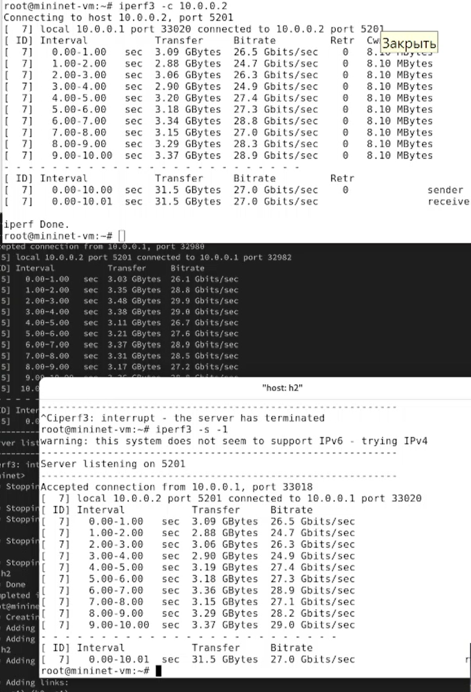{#fig:016 width=70%}

Экспортировала вывод результатов теста в формате JSON в файл, перенаправив стандартный вывод в файл (рис. [-@fig:017]).

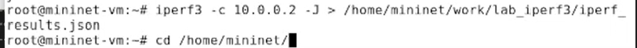{#fig:017 width=70%}

Перешла в каталог для работы над проектом и скорректировала права доступа к файлу JSON (рис. [-@fig:018]).

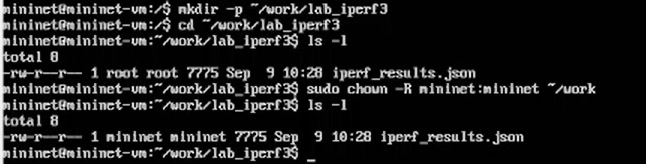{#fig:018 width=70%}

Сгенерировала выходные данные для файла JSON, выполнив команду `plot_iperf.sh iperf3_results.json`. Убедилась, что файлы с данными и графиками сформировались. (рис. [-@fig:019]).

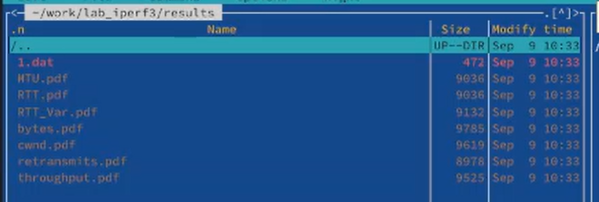{#fig:019 width=70%}

# Выводы

В ходе выполнения лабораторной работы я познакомилась с инструментом для измерения пропускной способности сети в режиме реального времени —iPerf3, а также получила навыки проведения интерактивного эксперимента по измерению пропускной способности моделируемой сети в среде Mininet.

# Список литературы{.unnumbered}

::: {#refs}
:::
