---
## Front matter
lang: ru-RU
title: Лабораторная работа № 3
subtitle: Измерение и тестирование пропускной способноти сети. Воспроизводимый  эксперимент
author:
  - Доберштейн А. С.
institute:
  - Российский университет дружбы народов, Москва, Россия

## i18n babel
babel-lang: russian
babel-otherlangs: english

## Formatting pdf
toc: false
toc-title: Содержание
slide_level: 2
aspectratio: 169
section-titles: true
theme: metropolis
header-includes:
 - \usetheme{metropolis}
 - \usepackage{fontspec}
 - \usepackage{polyglossia}
 - \setdefaultlanguage{russian}
 - \setmainfont{FreeSerif}
 - \setsansfont{FreeSerif}
 - \setmonofont{FreeSerif}
 - \usepackage{amsmath}
 - \usepackage{amssymb}
---

# Информация

## Докладчик

:::::::::::::: {.columns align=center}
::: {.column width="70%"}

  * Доберштейн Алина Сергеевна
  * НФИбд-02-22
  * Российский университет дружбы народов
  * [1132226448@pfur.ru](mailto:1132226448@pfur.ru)

:::

::::::::::::::

## Цель работы

Основной целью работы является знакомство с инструментом для измерения пропускной способности сети в режиме реального времени —iPerf3, а также получение навыков проведения воспроизводимого эксперимента по измерению пропускной способности моделируемой сети в среде Mininet.

## Задание

1. Воспроизвести посредством API Mininet эксперименты по измерению пропускной способности с помощью iPerf3.
2. Построить графики по проведённому эксперименту.

## Выполнение лабораторной работы

С помощью API Mininet создала простейшую топологию сети.

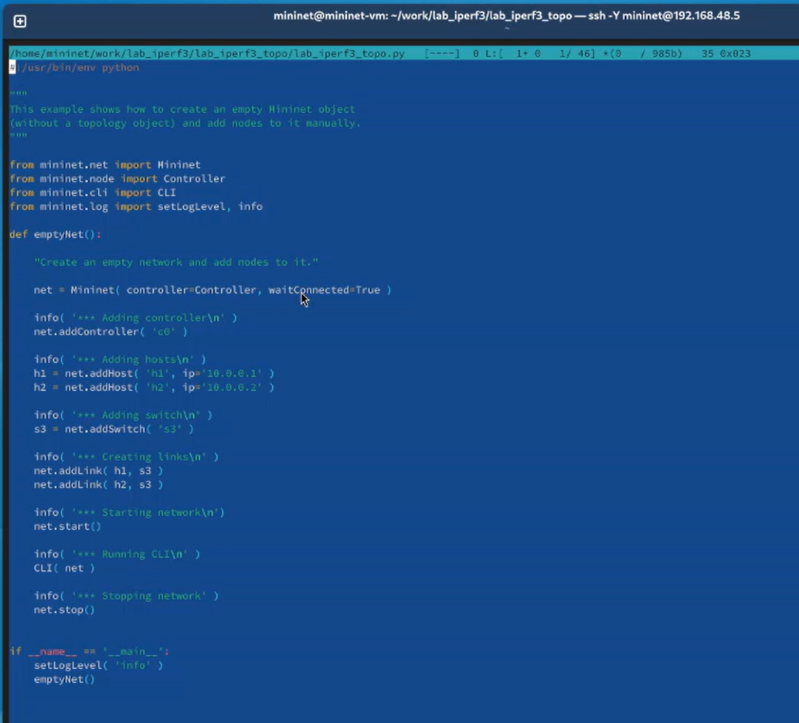{#fig:001 width=70%}

## Выполнение лабораторной работы

Запустила скрипт создания топологии, посмотрела элементы топологии и завершила работу mininet.

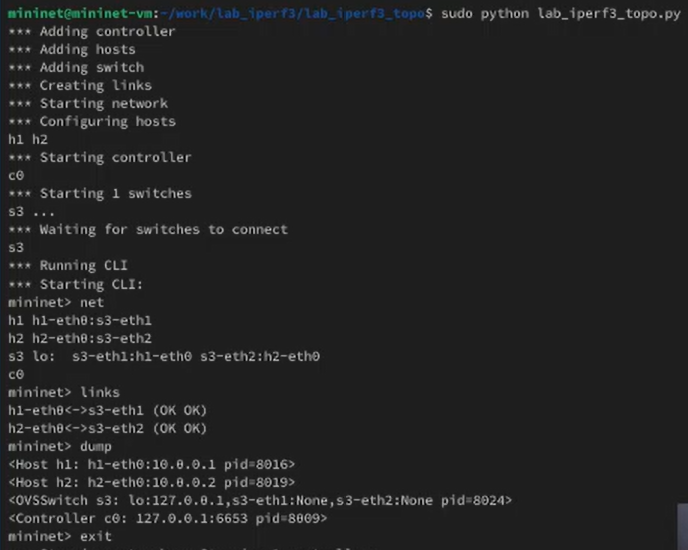{#fig:002 width=70%}

## Выполнение лабораторной работы

Внесла изменения в скрипт, позволяющие вывести на экран информацию о хостах h1 и h2 (IP- и MAC-адреса).

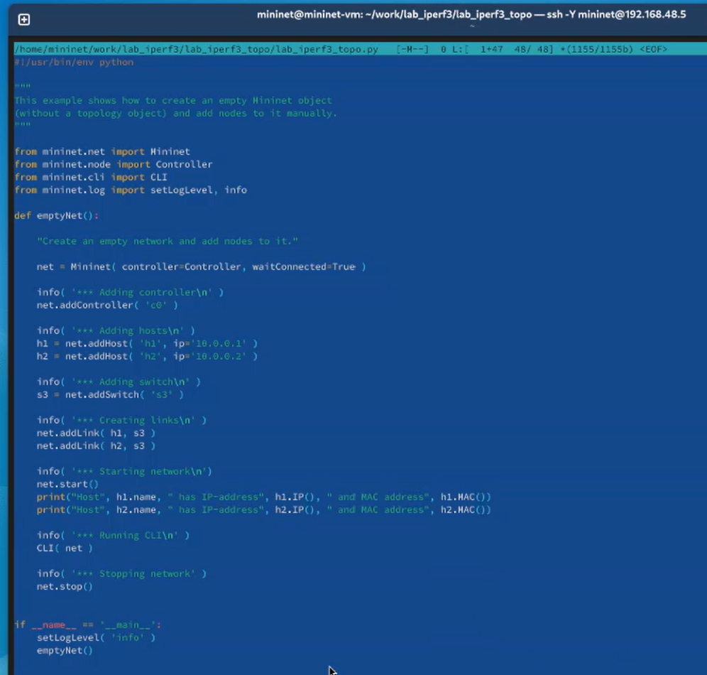{#fig:003 width=60%}

## Выполнение лабораторной работы

Проверила корректность отработки скрипта.

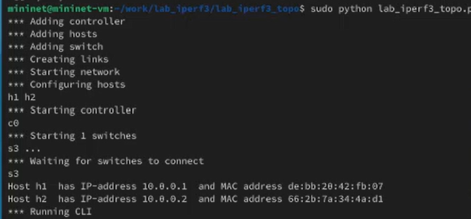{#fig:004 width=70%}

## Выполнение лабораторной работы

Сделала копию скрипта и в начале скрипта lab_iperf3_topo2.py добавила запись об импорте классов, изменила строку описания сети (добавила ограничения производительности и изоляции), функцию задания параметров виртуального хоста h1 и h2 (им выделено 50% от общих ресурсов процессора системы), функцию параметров соединения между s1 и s3.

## Выполнение лабораторной работы

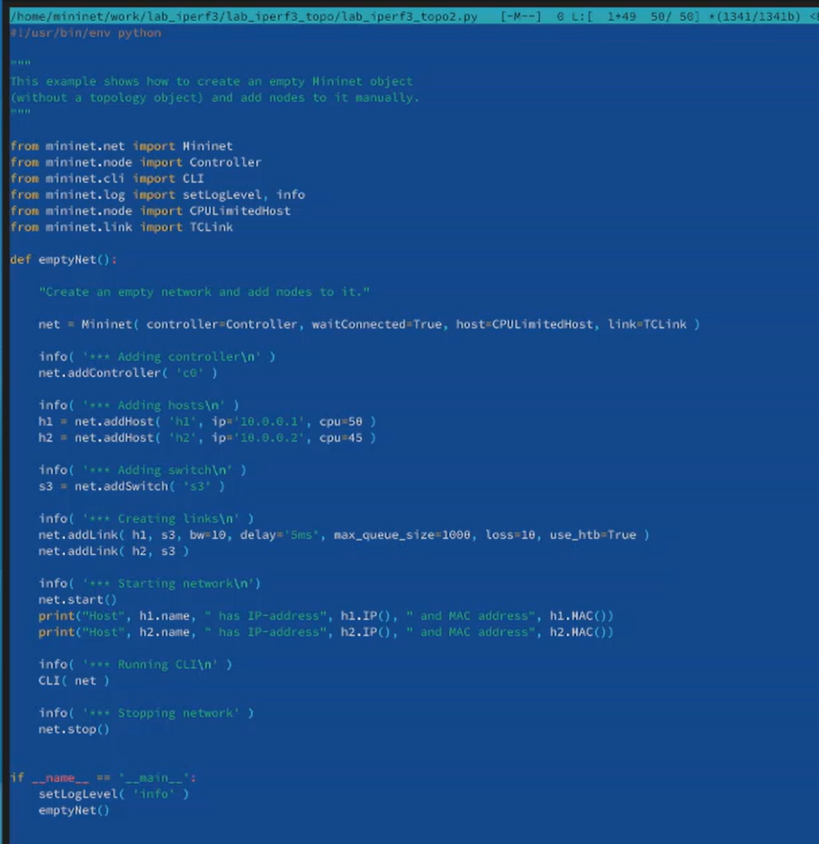{#fig:005 width=60%}

## Выполнение лабораторной работы

Запустила на отработку сначала lab_iperf3_topo2.py, затем lab_iperf3_topo.py, сравнила результат.

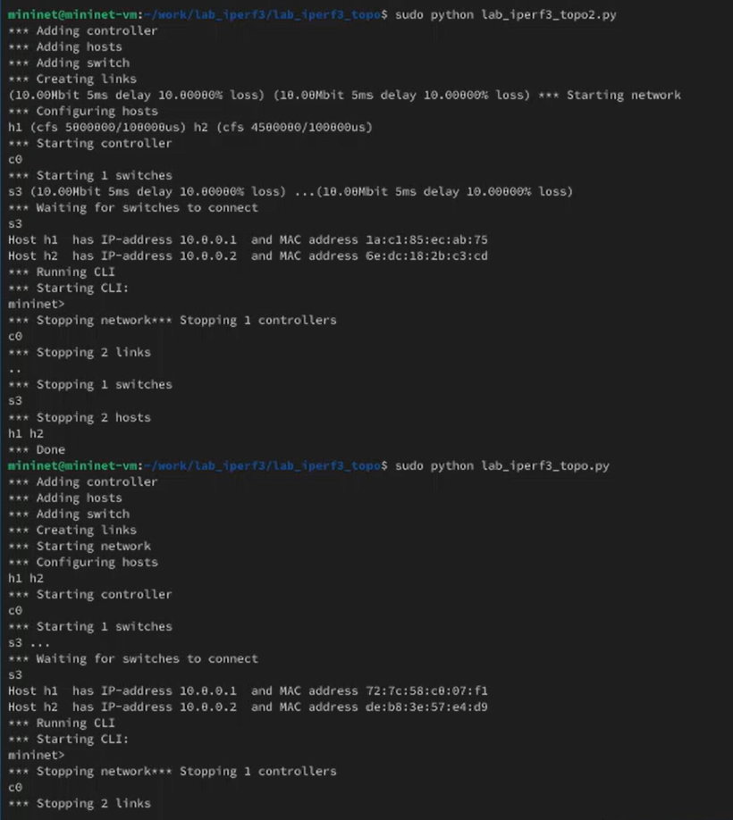{#fig:006 width=70%}

## Выполнение лабораторной работы

Сделала копию скрипта lab_iperf3_topo2.py, поместила его в подкаталог iperf3. В начале скрипта добавила запись `import time`. Изменила код в скрипте: на хостах убрала ограничение по использованию ресурсов процессора, каналы между хостами по 100Мбит/с с задержкой 75 мс, без потерь, без использования ограничителей пропускной способности и максимального размера очереди. После функции старта описала запуск на хосте h2 сервера iPerf3, а нахосте h1 запуск с задержкой в 10 секунд клиента iPerf3 с экспортом результатов в JSON-файл, закомментировала строки,отвечающие за запуск CLI-интерфейса.

## Выполнение лабораторной работы

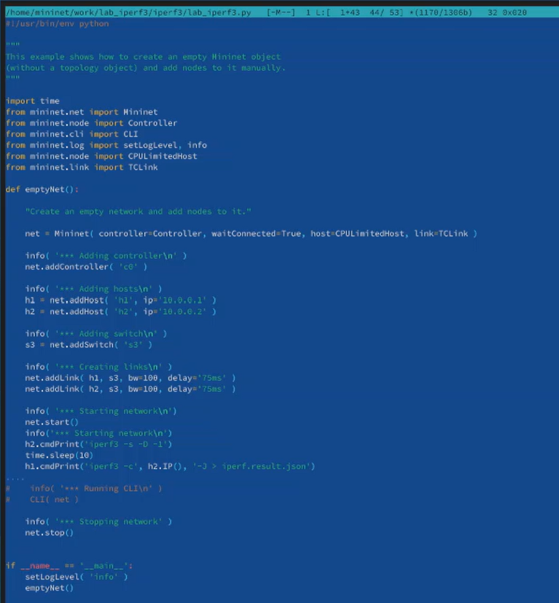{#fig:007 width=60%}

## Выполнение лабораторной работы

Запустила скрипт на отработку.

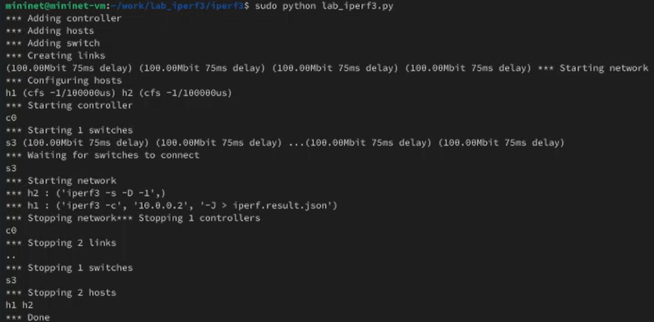{#fig:008 width=70%}

## Выполнение лабораторной работы

Построила графики из получившегося JSON файла.

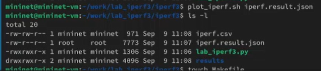{#fig:009 width=70%}

## Выполнение лабораторной работы

Создала Makefile для проведения всего эксперимента.

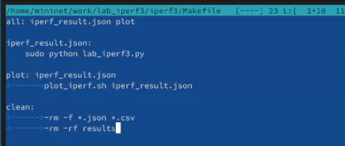{#fig:010 width=70%}

## Выполнение лабораторной работы

Проверила корректность отработки Makefile.

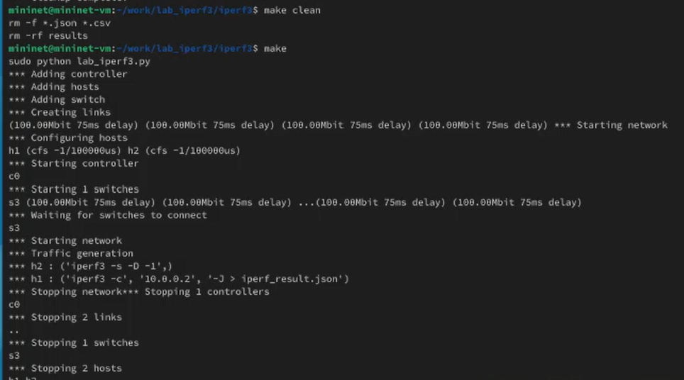{#fig:011 width=70%}

## Выводы

В ходе выполнения лабораторной работы я познакомилась с инструментом для измерения пропускной способности сети в режиме реального времени —iPerf3, а также получила навыки проведения воспроизводимого эксперимента по измерению пропускной способности моделируемой сети в среде Mininet.