---
## Front matter
title: "Лабораторная работа № 3"
subtitle: "Моделирование сетей передачи данных"
author: "Доберштейн Алина Сергеевна"

## Generic otions
lang: ru-RU
toc-title: "Содержание"

## Bibliography
bibliography: bib/cite.bib
csl: pandoc/csl/gost-r-7-0-5-2008-numeric.csl

## Pdf output format
toc: true # Table of contents
toc-depth: 2
lof: true # List of figures
lot: false # List of tables
fontsize: 12pt
linestretch: 1.5
papersize: a4
documentclass: scrreprt
## I18n polyglossia
polyglossia-lang:
  name: russian
  options:
  - spelling=modern
  - babelshorthands=true
polyglossia-otherlangs:
  name: english
## I18n babel
babel-lang: russian
babel-otherlangs: english
## Fonts
mainfont: FreeSerif
romanfont: FreeSerif
sansfont: FreeSerif
monofont: FreeSerif
mainfontoptions: Ligatures=Common,Ligatures=TeX,Scale=0.94
romanfontoptions: Ligatures=Common,Ligatures=TeX,Scale=0.94
sansfontoptions: Ligatures=Common,Ligatures=TeX,Scale=MatchLowercase,Scale=0.94
monofontoptions: Scale=MatchLowercase,Scale=0.94,FakeStretch=0.9
mathfontoptions:
## Biblatex
biblatex: true
biblio-style: "gost-numeric"
biblatexoptions:
  - parentracker=true
  - backend=biber
  - hyperref=auto
  - language=auto
  - autolang=other*
  - citestyle=gost-numeric
## Pandoc-crossref LaTeX customization
figureTitle: "Рис."
tableTitle: "Таблица"
listingTitle: "Листинг"
lofTitle: "Список иллюстраций"
lotTitle: "Список таблиц"
lolTitle: "Листинги"
## Misc options
indent: true
header-includes:
  - \usepackage{indentfirst}
  - \usepackage{float} # keep figures where there are in the text
  - \floatplacement{figure}{H} # keep figures where there are in the text
---

# Цель работы

Основной целью работы является знакомство с инструментом для измерения пропускной способности сети в режиме реального времени —iPerf3, а также получение навыков проведения воспроизводимого эксперимента по измерению пропускной способности моделируемой сети в среде Mininet.

# Задание

1. Воспроизвести посредством API Mininet эксперименты по измерению пропускной способности с помощью iPerf3.
2. Построить графики по проведённому эксперименту.

# Теоретическое введение

Application Programming Interface (API) — программный интерфейс приложения, (или интерфейс программирования приложений) представляет собой специальный протокол для взаимодействия компьютерных программ,который позволяет использовать функции одного приложения внутри другого.

# Выполнение лабораторной работы

С помощью API Mininet создала простейшую топологию сети, состояющую из двух хостов и коммутатора: в каталоге для работы над проектом создала подкаталог lab_iperf3_topo и скопировала в него файл с примером скрипта, описывающего стандартную простую топологию сети. (рис. [-@fig:001]).

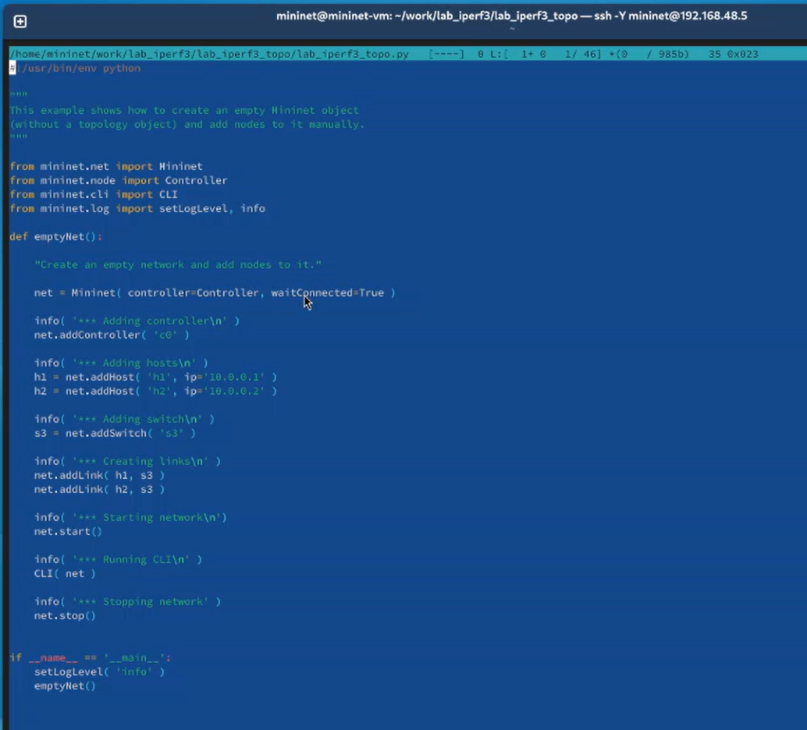{#fig:001 width=70%}

Запустила скрипт создания топологии, посмотрела элементы топологии и завершила работу mininet (рис. [-@fig:002]).

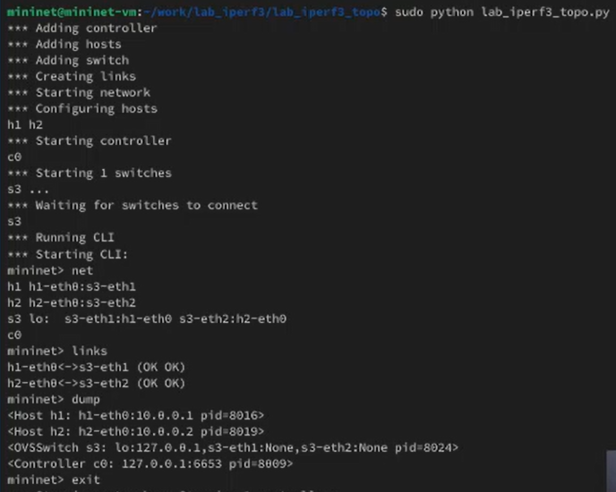{#fig:002 width=70%}

Внесла изменения в скрипт, позволяющие вывести на экран информацию о хостах h1 и h2 (IP- и MAC-адреса). (рис. [-@fig:003]).

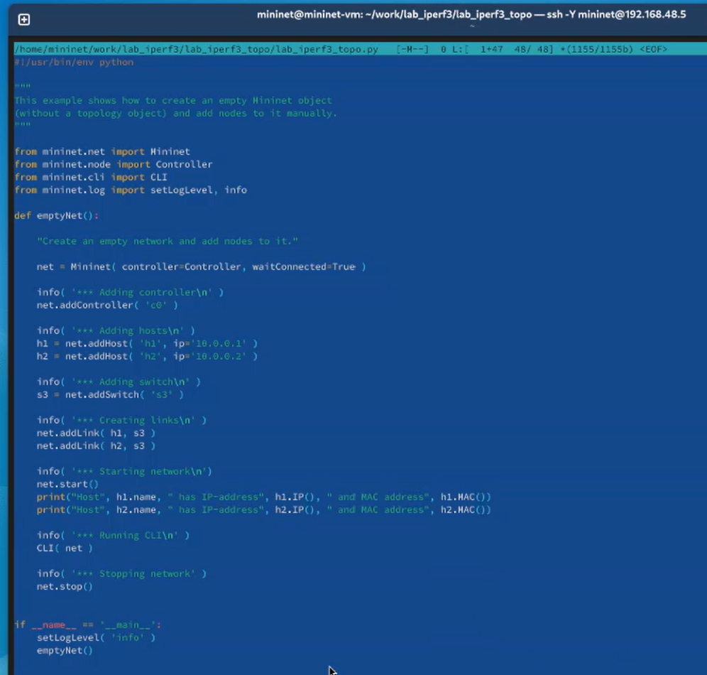{#fig:003 width=70%}

Проверила корректность отработки скрипта (рис. [-@fig:004]).

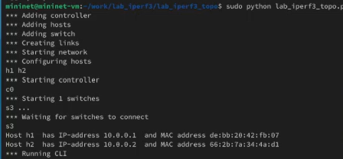{#fig:004 width=70%}

Сделала копию скрипта и в начале скрипта lab_iperf3_topo2.py добавила запись об импорте классов, изменила строку описания сети (добавила ограничения производительности и изоляции), функцию задания параметров виртуального хоста h1 и h2 (им выделено 50% от общих ресурсов процессора системы), функцию параметров соединения между s1 и s3.(рис. [-@fig:005]).

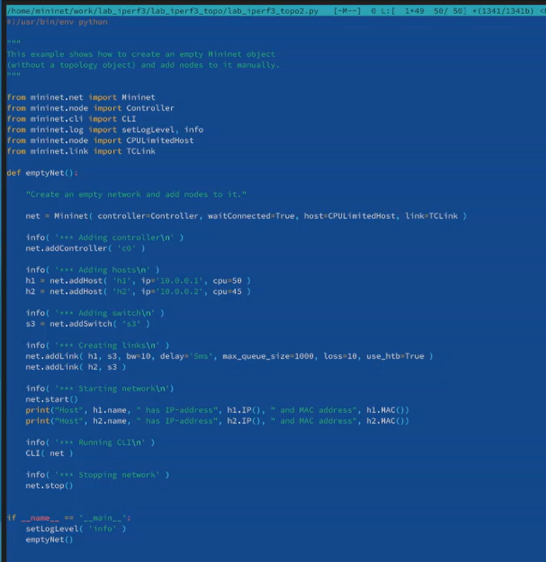{#fig:005 width=70%}

Запустила на отработку сначала lab_iperf3_topo2.py, затем lab_iperf3_topo.py, сравнила результат. (рис. [-@fig:006]).

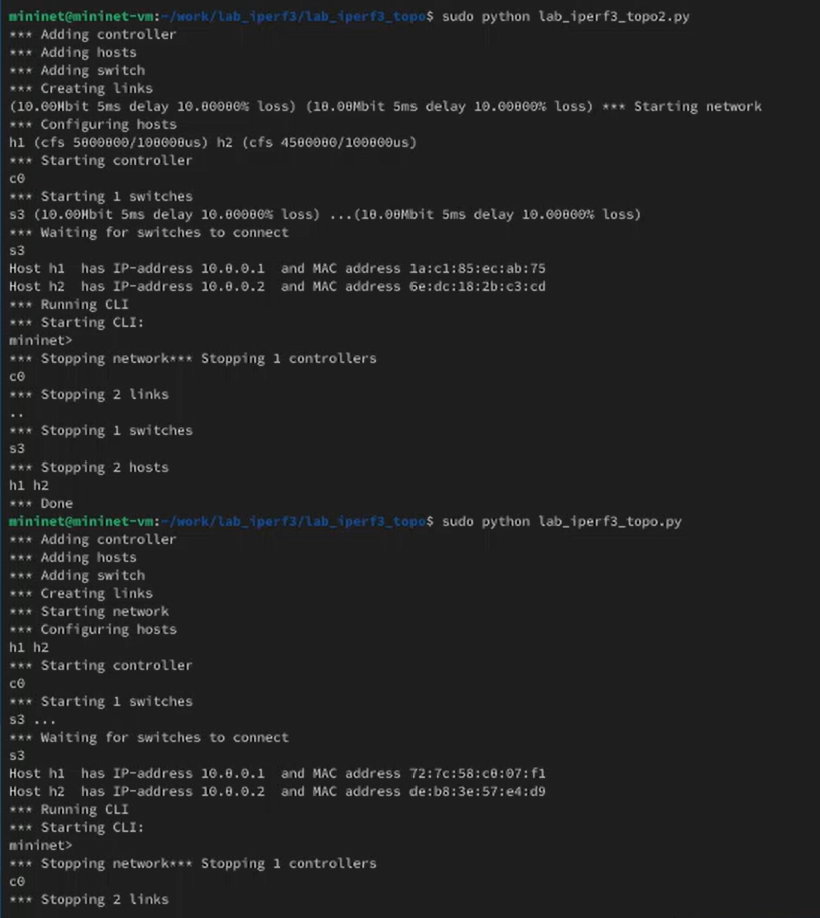{#fig:006 width=70%}

Сделала копию скрипта lab_iperf3_topo2.py, поместила его в подкаталог iperf3. В начале скрипта добавила запись `import time`. Изменила код в скрипте: на хостах убрала ограничение по использованию ресурсов процессора, каналы между хостами по 100Мбит/с с задержкой 75 мс, без потерь, без использования ограничителей пропускной способности и максимального размера очереди. После функции старта описала запуск на хосте h2 сервера iPerf3, а нахосте h1 запуск с задержкой в 10 секунд клиента iPerf3 с экспортом результатов в JSON-файл, закомментировала строки,отвечающие за запуск CLI-интерфейса.(рис. [-@fig:007]).

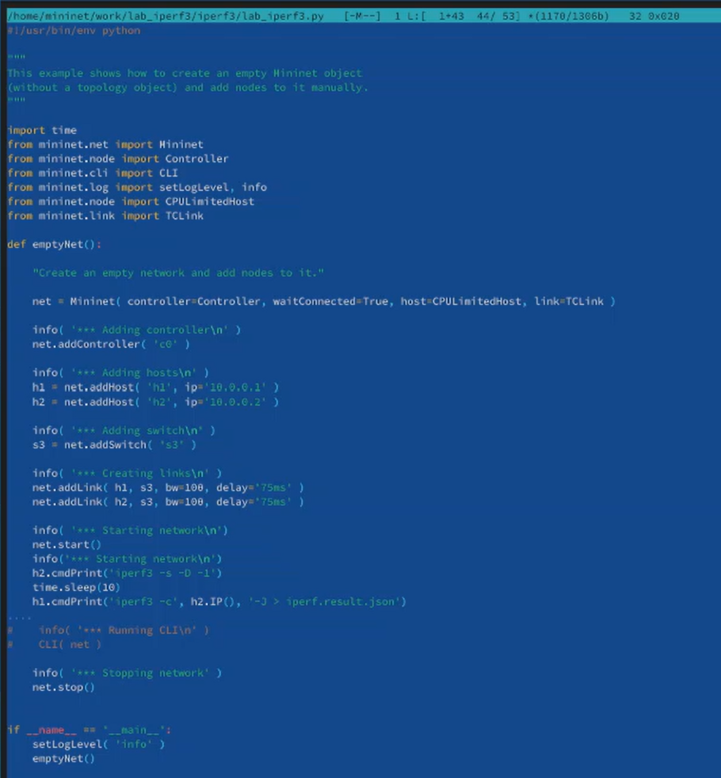{#fig:007 width=70%}

Запустила скрипт на отработку. (рис. [-@fig:008]).

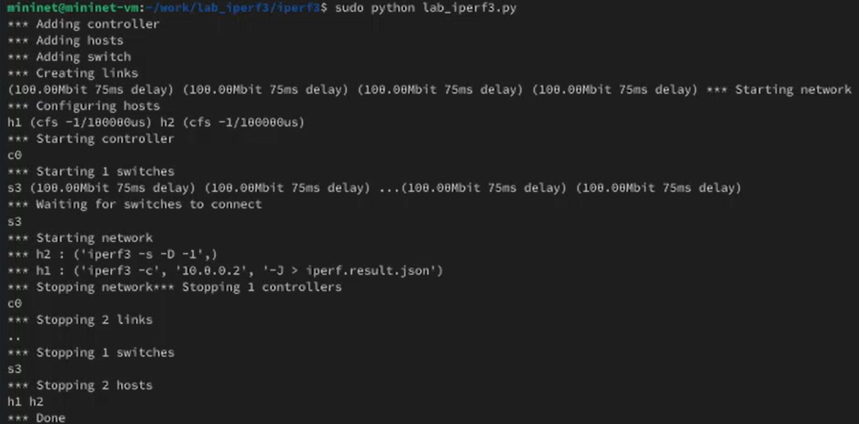{#fig:008 width=70%}

Построила графики из получившегося JSON файла (рис. [-@fig:009]).

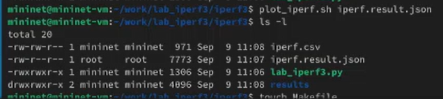{#fig:009 width=70%}

Создала Makefile для проведения всего эксперимента (рис. [-@fig:010]).

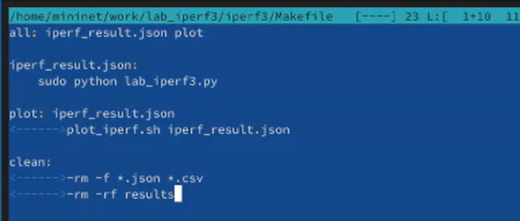{#fig:010 width=70%}

Проверила корректность отработки Makefile (рис. [-@fig:011]).

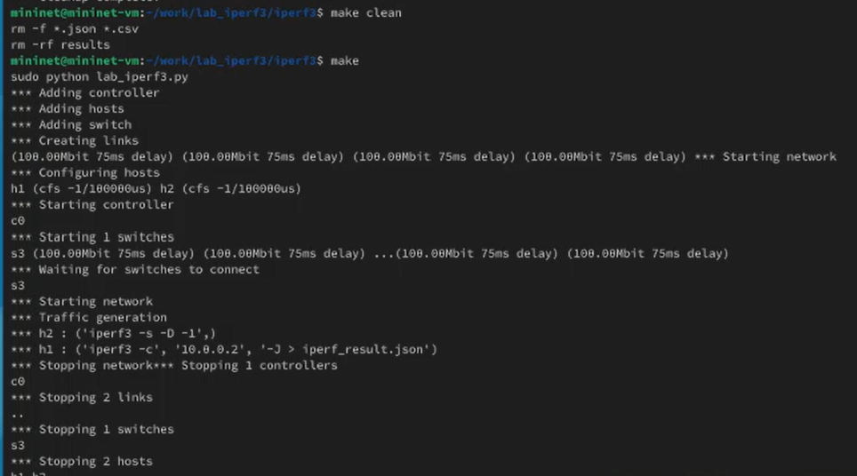{#fig:011 width=70%}

# Выводы

В ходе выполнения лабораторной работы я познакомилась с инструментом для измерения пропускной способности сети в режиме реального времени —iPerf3, а также получила навыки проведения воспроизводимого эксперимента по измерению пропускной способности моделируемой сети в среде Mininet.

# Список литературы{.unnumbered}

::: {#refs}
:::
