---
## Front matter
title: "Лабораторная работа № 4"
subtitle: "Моделирование сетей передачи данных"
author: "Доберштейн Алина Сергеевна"

## Generic otions
lang: ru-RU
toc-title: "Содержание"

## Bibliography
bibliography: bib/cite.bib
csl: pandoc/csl/gost-r-7-0-5-2008-numeric.csl

## Pdf output format
toc: true # Table of contents
toc-depth: 2
lof: true # List of figures
lot: false # List of tables
fontsize: 12pt
linestretch: 1.5
papersize: a4
documentclass: scrreprt
## I18n polyglossia
polyglossia-lang:
  name: russian
  options:
  - spelling=modern
  - babelshorthands=true
polyglossia-otherlangs:
  name: english
## I18n babel
babel-lang: russian
babel-otherlangs: english
## Fonts
mainfont: FreeSerif
romanfont: FreeSerif
sansfont: FreeSerif
monofont: FreeSerif
mainfontoptions: Ligatures=Common,Ligatures=TeX,Scale=0.94
romanfontoptions: Ligatures=Common,Ligatures=TeX,Scale=0.94
sansfontoptions: Ligatures=Common,Ligatures=TeX,Scale=MatchLowercase,Scale=0.94
monofontoptions: Scale=MatchLowercase,Scale=0.94,FakeStretch=0.9
mathfontoptions:
## Biblatex
biblatex: true
biblio-style: "gost-numeric"
biblatexoptions:
  - parentracker=true
  - backend=biber
  - hyperref=auto
  - language=auto
  - autolang=other*
  - citestyle=gost-numeric
## Pandoc-crossref LaTeX customization
figureTitle: "Рис."
tableTitle: "Таблица"
listingTitle: "Листинг"
lofTitle: "Список иллюстраций"
lotTitle: "Список таблиц"
lolTitle: "Листинги"
## Misc options
indent: true
header-includes:
  - \usepackage{indentfirst}
  - \usepackage{float} # keep figures where there are in the text
  - \floatplacement{figure}{H} # keep figures where there are in the text
---

# Цель работы

Основной целью работы является знакомство с NETEM—инструментом для тестирования производительности приложений в виртуальной сети, а также получение навыков проведения интерактивного и воспроизводимого экспериментов по измерению задержкии её дрожания(jitter) в моделируемой сети в среде Mininet.

# Задание

1. Задайте простейшую  топологию,состоящую издвух хостов и коммутатора с назначенной по умолчанию mininet сетью 10.0.0.0/8.
2. Проведите интерактивные эксперименты подобавлению/изменению задержки,джиттера,значения корреляции для джиттера и задержки,распределения времени задержки в эмулируемой глобальной сети.
3. Реализуйте воспроизводимый эксперимент по заданию значения задержки в эмулируемой глобальной сети. Постройте график.
4. Самостоятельно реализуйте воспроизводимые эксперименты по изменению задержки, джиттера, значения корреляции для джиттера и задержки, распределения времени задержки в эмулируемой глобальной сети. Постройте графики.

# Теоретическое введение

NETEM—сетевой эмулятор Linux, используемый для тестирования производительности реальных клиент-серверных приложений в виртуальной сети. Виртуальная сеть в данном случае представляет собой лабораторную среду для воспроизведения поведения глобальной сети (Wide Area Network,WAN). NETEM позволяет пользователю задать ряд параметров сети,например,задержку,дрожание задержки (jitter), уровень потери пакетов, дублирование и изменение порядка пакетов.

# Выполнение лабораторной работы

Запустила виртуальную среду с mininet, пожключилась из основной ОС, проверила права запуска Х-соединения (рис. [-@fig:001]).

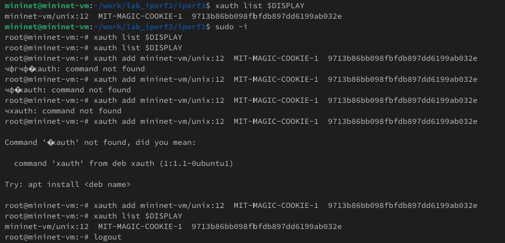{#fig:001 width=70%}

Задала простейшую топологию, состояющую из двух хостов и коммутатора. (рис. [-@fig:002]).

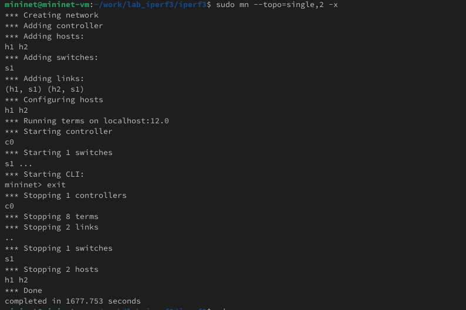{#fig:002 width=70%}

На хостах вывела команду `ifconfig`, проверила подключение между хостами.(рис. [-@fig:003]).

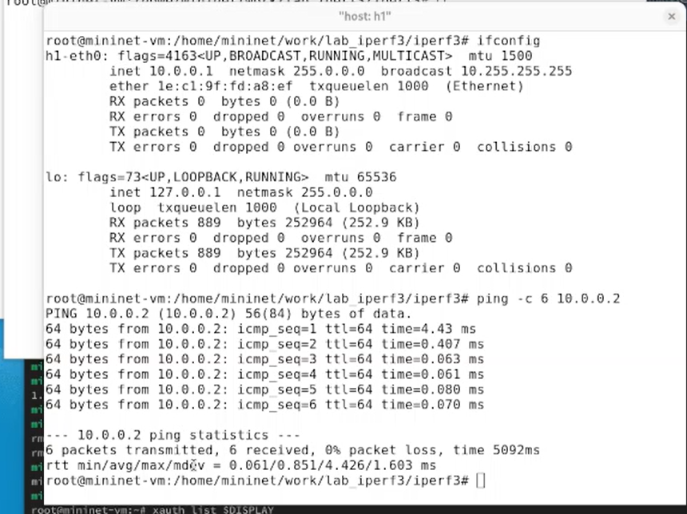{#fig:003 width=70%}

минимальное отклонение времени приёма-передачи (RTT) - 0.061 ms, среднее - 0.851 ms, максимальное - 4.426 ms и стандартное - 1.603 ms

## Интерактивные эксперименты

### Добавление задержки в эмулироемой глобальной сети

На хосте h1 добавила задержку в 100 мс к выходному интерфейсу, проверила соединение от h1 к h2(рис. [-@fig:004]).

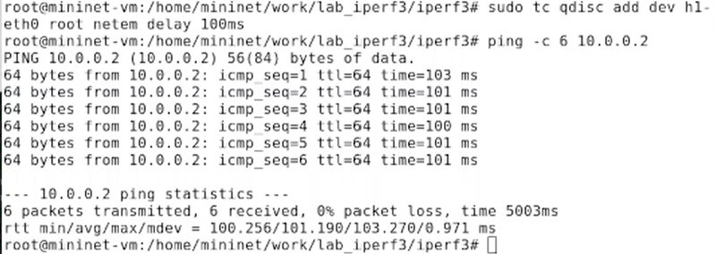{#fig:004 width=70%}

минимальное отклонение времени приёма-передачи (RTT) - 100.256 ms, среднее - 101.190 ms, максимальное - 103.270 ms и стандартное - 0.971 ms

Для эмуляции глобальной сети с двунаправленной зажержкой добавила задержку в 100 мс на h2. Проверила связь между хостами (рис. [-@fig:005]).

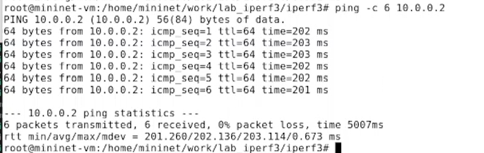{#fig:005 width=70%}

минимальное отклонение времени приёма-передачи (RTT) - 201.260 ms, среднее - 202.136 ms, максимальное - 203.114 ms и стандартное - 0.673 ms

### Изменение задержки в эмулироемой глобальной сети

Изменила задержзку со 100ьс до 50мс для отправителя h1 и получателя h2. Проверила связь между хостами (рис. [-@fig:006]).

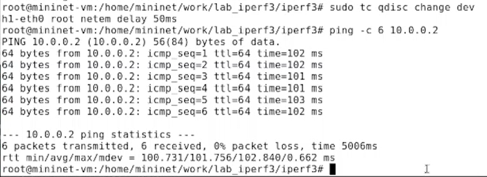{#fig:006 width=70%}

минимальное отклонение времени приёма-передачи (RTT) - 100.731 ms, среднее - 102.840 ms, максимальное - 102.840 ms и стандартное - 0.662 ms

### Восстановление исходных значений (удаление правил) задержки в эмулируемой глобальной сети

Восстановила конфигурацию по умолчанию, удалив все правила.Проверила связь между хостами (рис. [-@fig:007]).

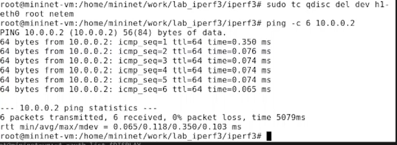{#fig:007 width=70%}

минимальное отклонение времени приёма-передачи (RTT) - 0.065 ms, среднее - 0.118 ms, максимальное - 0.350 ms и стандартное - 0.103 ms

### Добавление значения дрожания задержки в интерфейс подключения к эмулируемой глобальной сети

В сетях нет постоянной задержки. На узле h1 добавила задержку 100 мс со случайным отклонением 10 мс. Проверила связь между хостами (рис. [-@fig:008]).

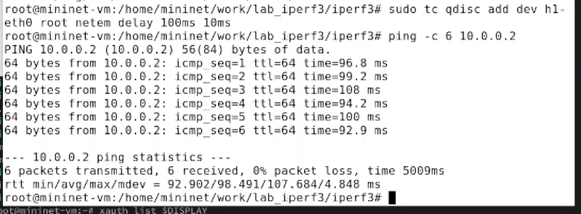{#fig:008 width=70%}

минимальное отклонение времени приёма-передачи (RTT) - 92.902 ms, среднее - 98.491 ms, максимальное - 107.684 ms и стандартное - 4.848 ms

### Добавление значения корреляции для джиттера и задержки в интерфейс подключения к эмулируемой глобальной сети

Добавила на интерфейсе h1 задержку в 100мс с вариацией +-10 мс и значением корреляции 25%. Проверила связь между хостами (рис. [-@fig:009]-[-@fig:010]).

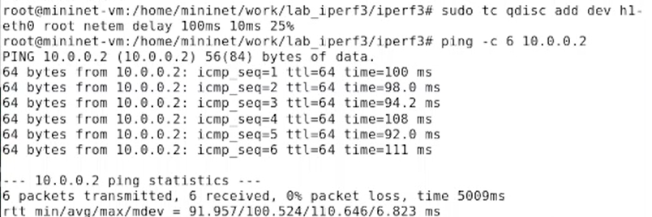{#fig:009 width=70%}

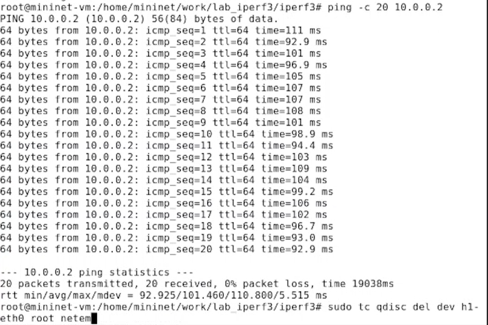{#fig:010 width=70%}

минимальное отклонение времени приёма-передачи (RTT) - 91.957 ms, среднее - 100.524 ms, максимальное - 110.646 ms и стандартное - 6.823 ms

### Распределение задержки в интерфейсе подключения к эмулируемой глобальной сети

Задала нормальное распределение задержки на узле h1 в эмулируемой сети. Убедилась, что все пакеты, покидающие хост h1 на интерфейсе h1-eth0, имеют время задержки, которое распределено в диапазоне 100 мс ±20 мс. Восстановим конфигурацию интерфейса по умолчанию на узле h1. Завершим работу mininet в интерактивном режиме (рис. [-@fig:011]).

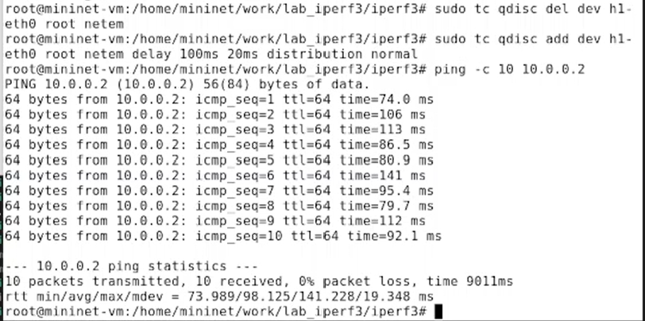{#fig:011 width=70%}

## Воспроизведение экспериментов

### Предварительная подготовка

Обновила репозитории ПО на виртуальной машине, установила пакет geeqie. (рис. [-@fig:012]).

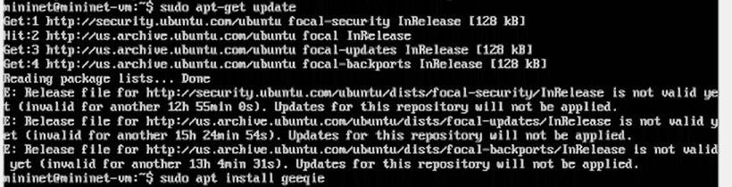{#fig:012 width=70%}

### Добавление задержки для интерфейса, подключающегося к эмулируемой глобальной сети

С помощью API Mininet воспроизвела эксперимент по добавлению задержки для интерфейса хоста, подключающегося к эмулируемой глобальной сети.
В виртуальной среде mininet в своём рабочем каталоге с проектами создала каталог simple-delay и перешла в него. (рис. [-@fig:013]).

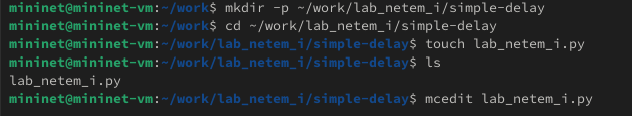{#fig:013 width=70%}

Создала скрипт для эксперимента (рис. [-@fig:014]).

{#fig:014 width=70%}

Создала скрипт для визуализации результатов эксперимента (рис. [-@fig:015]).

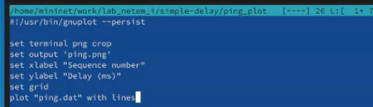{#fig:015 width=70%}

Задала права доступа к файлу скрипта (рис. [-@fig:016]).

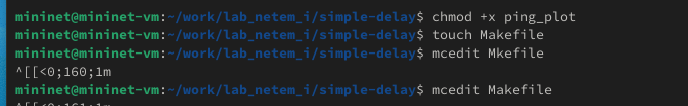{#fig:016 width=70%}

Создала Makefile для управления процессом проведения эксперимента (рис. [-@fig:017]).

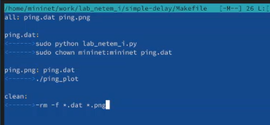{#fig:017 width=70%}

Выполнила эксперимент (рис. [-@fig:018]).

{#fig:018 width=70%}

Продемонстрировала график (рис. [-@fig:019]).

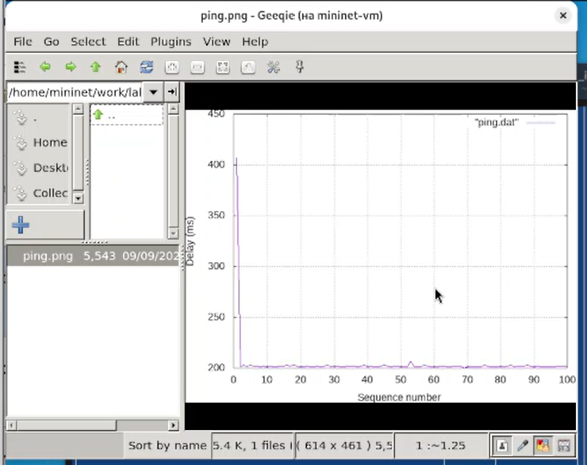{#fig:019 width=70%}

Разработала скрипт для вычисления минимального, среднего, максимального и стандартного rtt на основе данных файла ping.dat, добавила правило запуска в Makefile (рис. [-@fig:020]).

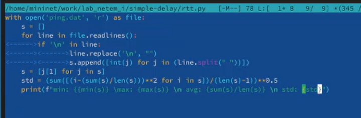{#fig:020 width=70%}

Продемонстрировала работу скрипта (рис. [-@fig:021]).

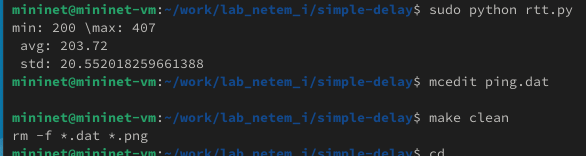{#fig:021 width=70%}

### Воспроизводимый эксперимент по изменению задержки

В виртуальной среде mininet в своём рабочем каталоге с проектами создала каталог change-delay и перешла в него. (рис. [-@fig:022]).

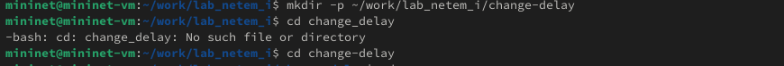{#fig:022 width=70%}

Скопировала необходимые файлы из предыдущего эксперимента (рис. [-@fig:023]).

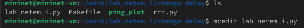{#fig:023 width=70%}

Создала скрипт для эксперимента (рис. [-@fig:024]).

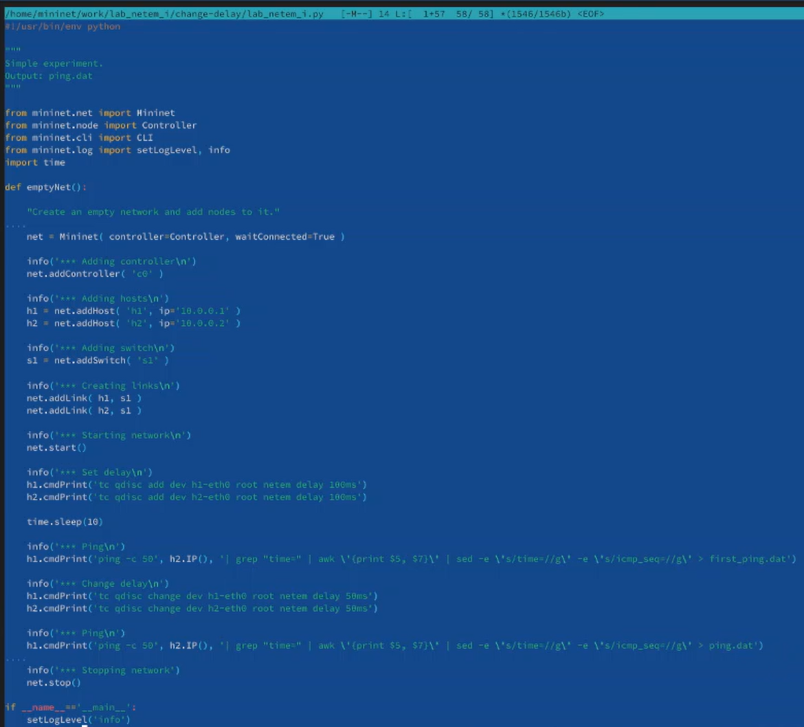{#fig:024 width=70%}

Выполнила эксперимент (рис. [-@fig:025]).

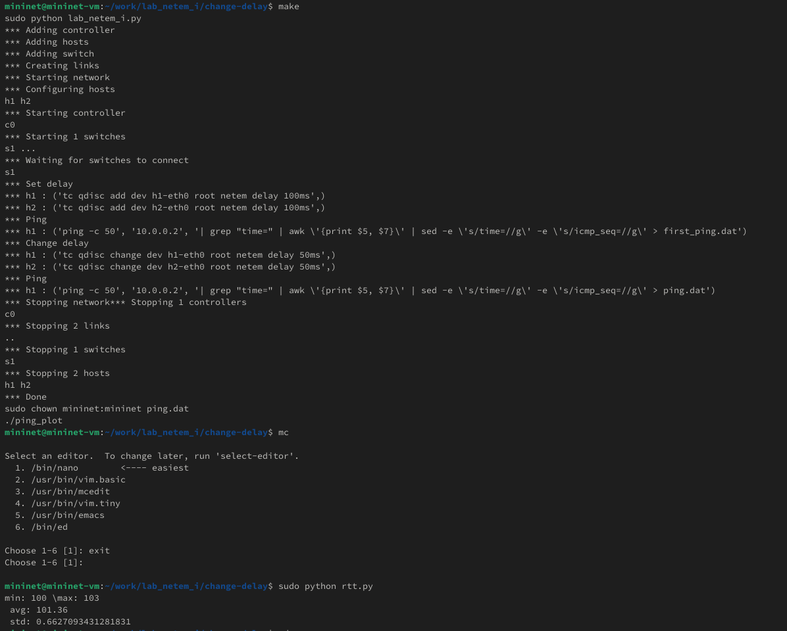{#fig:025 width=70%}

Продемонстрировала график (рис. [-@fig:026]).

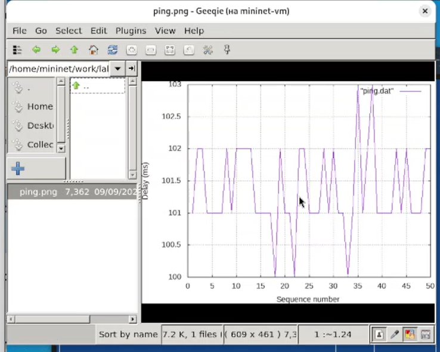{#fig:026 width=70%}

### Воспроизводимый эксперимент по изменению джиттера

В виртуальной среде mininet в своём рабочем каталоге с проектами создала каталог jitter-delay и перешла в него. Скопировала необходимые файлы из предыдущего эксперимента. (рис. [-@fig:027]).

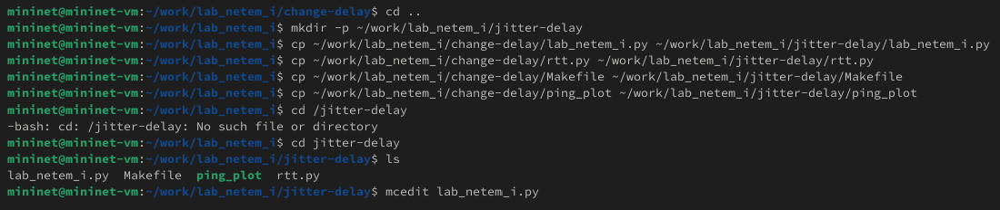{#fig:027 width=70%}

Создала скрипт для эксперимента (рис. [-@fig:028]).

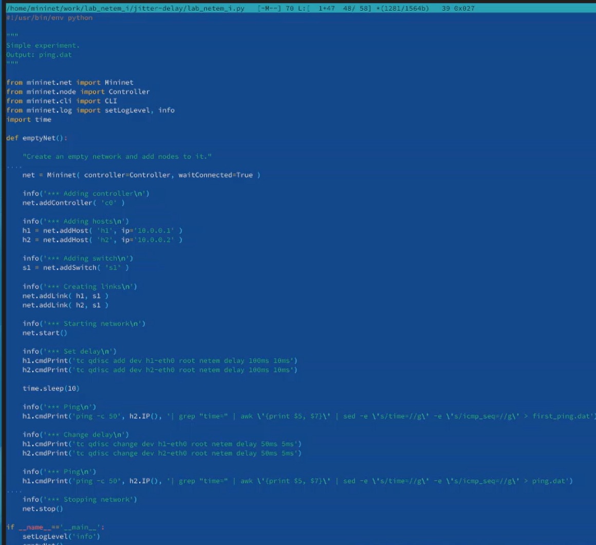{#fig:028 width=70%}

Выполнила эксперимент (рис. [-@fig:029]).

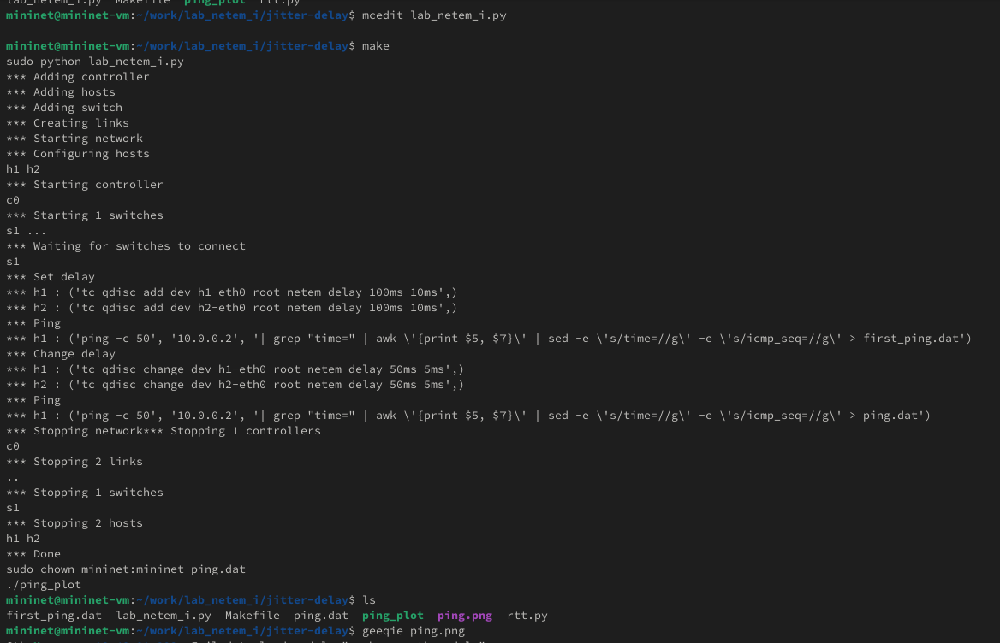{#fig:029 width=70%}

Продемонстрировала график (рис. [-@fig:030]).

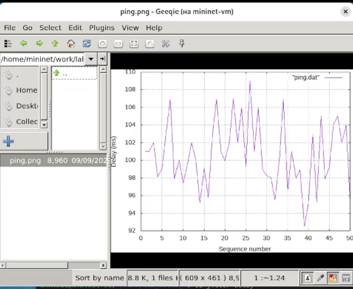{#fig:030 width=70%}

Продемонстрировала работу скрипта для вычиления rtt (рис. [-@fig:031]).

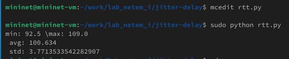{#fig:031 width=70%}

### Воспроизводимый эксперимент по изменению значения корреляции джиттера и задержки

В виртуальной среде mininet в своём рабочем каталоге с проектами создала каталог correlation-delay и перешла в него. Скопировала необходимые файлы из предыдущего эксперимента. (рис. [-@fig:032]).

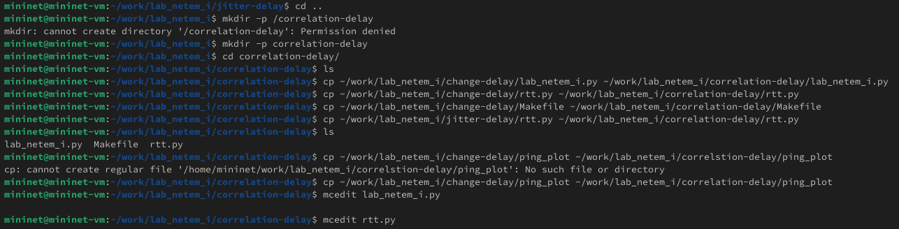{#fig:032 width=70%}

Создала скрипт для эксперимента (рис. [-@fig:033]).

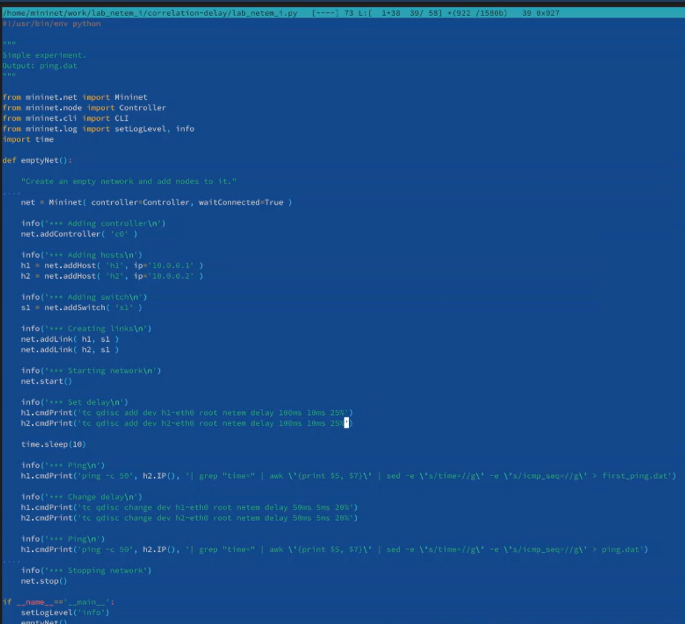{#fig:033 width=70%}

Выполнила эксперимент (рис. [-@fig:034]).

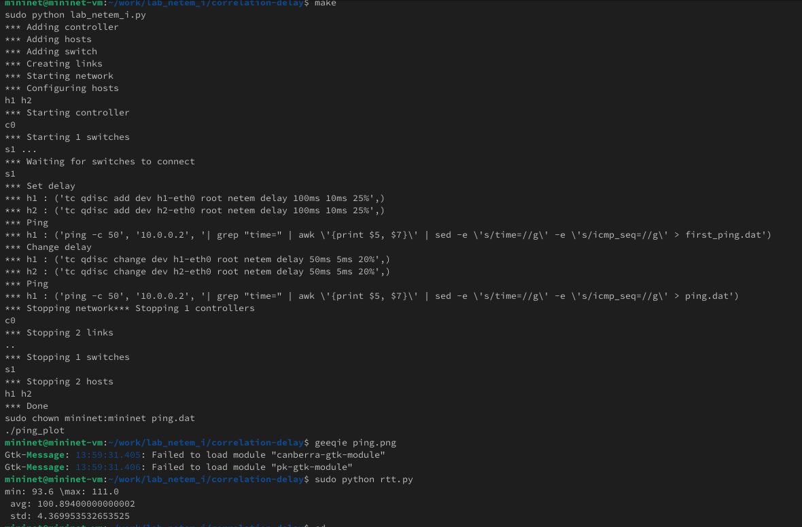{#fig:034 width=70%}

Продемонстрировала график (рис. [-@fig:035]).

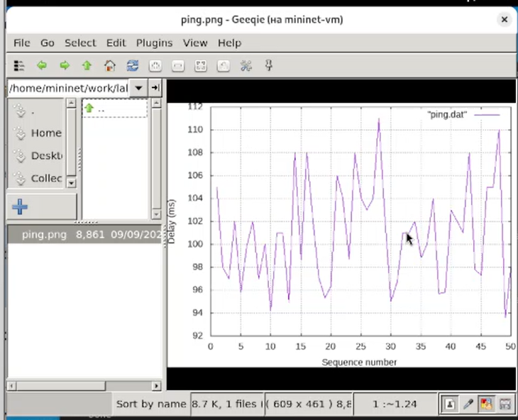{#fig:035 width=70%}

### Воспроизводимый эксперимент по изменению распределения времени задержки в эмулируемой глобальной сети

В виртуальной среде mininet в своём рабочем каталоге с проектами создала каталог distribution-delay и перешла в него. Скопировала необходимые файлы из предыдущего эксперимента. (рис. [-@fig:036]).

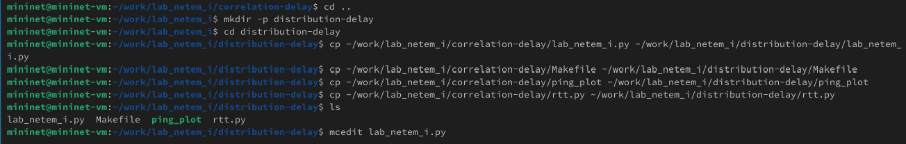{#fig:036 width=70%}

Создала скрипт для эксперимента (рис. [-@fig:037]).

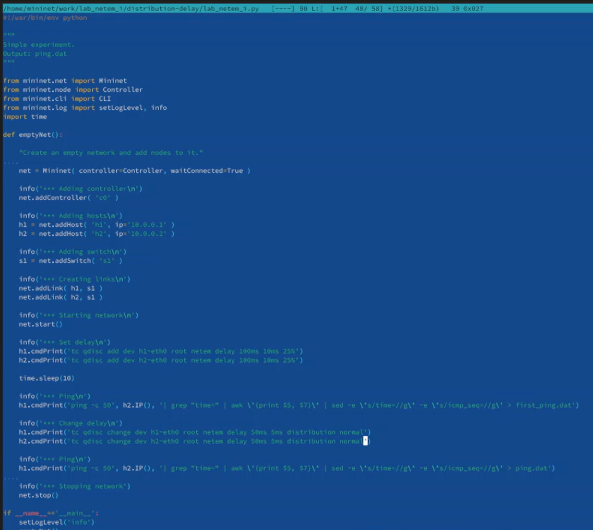{#fig:037 width=70%}

Выполнила эксперимент (рис. [-@fig:038]).

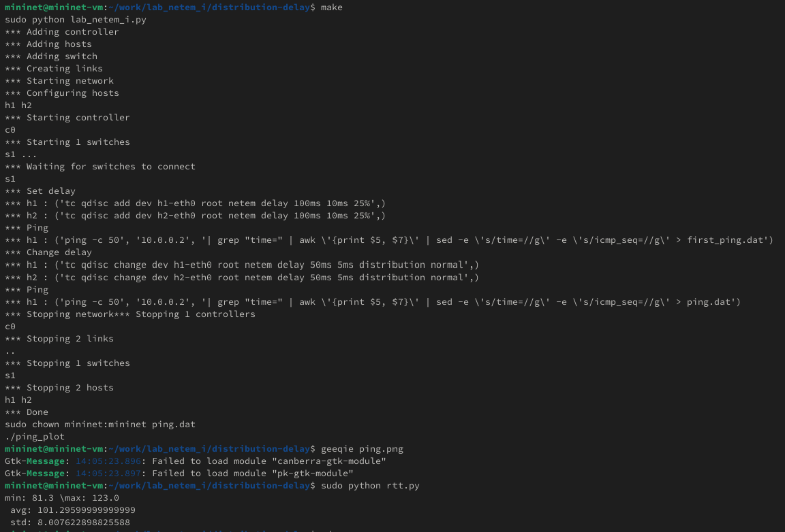{#fig:038 width=70%}

Продемонстрировала график (рис. [-@fig:039]).

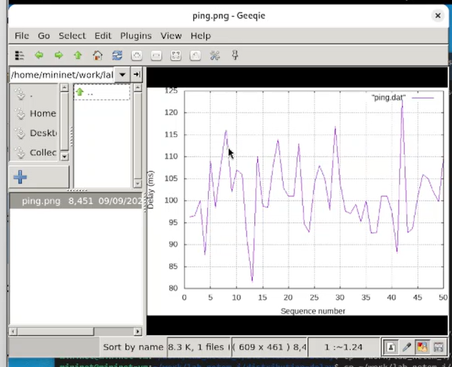{#fig:039 width=70%}

# Выводы

В результате выполнения данной лабораторной работы я познакомилась с NETEM -- инструментом для тестирования производительности приложений в виртуальной сети, а также получила навыки проведения интерактивного и воспроизводимого экспериментов по измерению задержки и её дрожания (jitter) в моделируемой сети в среде Mininet.

# Список литературы{.unnumbered}

::: {#refs}
:::
