---
## Front matter
lang: ru-RU
title: Лабораторная работа № 5
subtitle: Эмуляция и измерение потерь пакетов в глобальных сетях
author:
  - Доберштейн А. С.
institute:
  - Российский университет дружбы народов, Москва, Россия

## i18n babel
babel-lang: russian
babel-otherlangs: english

## Formatting pdf
toc: false
toc-title: Содержание
slide_level: 2
aspectratio: 169
section-titles: true
theme: metropolis
header-includes:
 - \usetheme{metropolis}
 - \usepackage{fontspec}
 - \usepackage{polyglossia}
 - \setdefaultlanguage{russian}
 - \setmainfont{FreeSerif}
 - \setsansfont{FreeSerif}
 - \setmonofont{FreeSerif}
 - \usepackage{amsmath}
 - \usepackage{amssymb}
---

# Информация

## Докладчик

:::::::::::::: {.columns align=center}
::: {.column width="70%"}

  * Доберштейн Алина Сергеевна
  * НФИбд-02-22
  * Российский университет дружбы народов
  * [1132226448@pfur.ru](mailto:1132226448@pfur.ru)

:::

::::::::::::::

## Цель работы

Основной целью работы является получение навыков проведения интерактивных экспериментов в среде Mininet по исследованию параметров сети, связанных с потерей, дублированием, изменением порядка и повреждением пакетов при передаче данных. Эти параметры влияют на производительность протоколов и сетей.

## Задание

1. Задайте простейшую топологию, состоящую из двух хостов и коммутатора с назначенной по умолчанию mininet сетью 10.0.0.0/8.
2. Проведите интерактивные эксперименты по по исследованию параметров сети, связанных с потерей, дублированием, изменением порядка и повреждением пакетов при передаче данных.
3. Реализуйте воспроизводимый эксперимент по добавлению правила отбрасывания пакетов в эмулируемой глобальной сети. На экран выведите сводную информацию о потерянных пакетах.
4. Самостоятельно реализуйте воспроизводимые эксперименты по исследованию параметров сети, связанных с потерей, изменением порядка и повреждением пакетов при передаче данных. На экран выведите своднуюинформацию о потерянных пакетах.

## Выполнение лабораторной работы

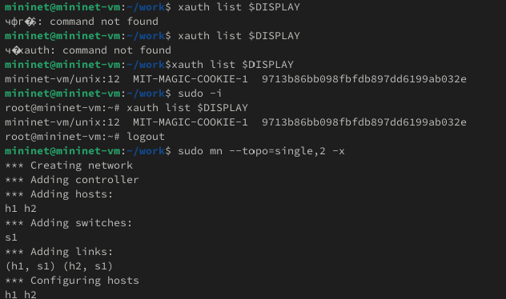{#fig:001 width=70%}

## Выполнение лабораторной работы

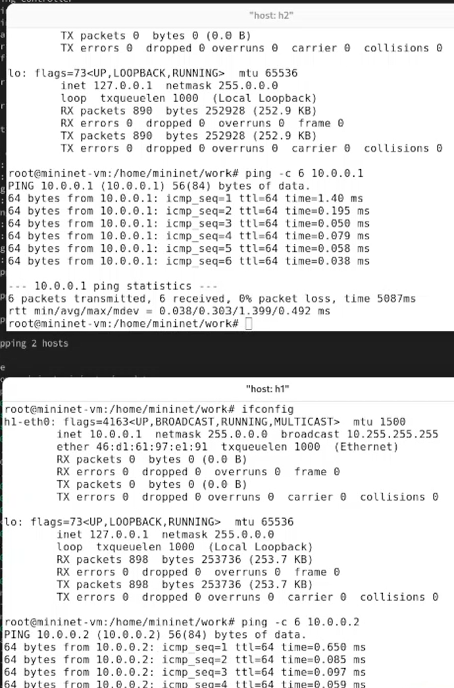{#fig:002 width=70%}

# Интерактивные эксперименты

##  Добавление потери пакетов на интерфейс,подключённый к эмулируемой глобальной сети

Пакеты могут быть потеряны в процессе передачи из-за таких факторов, как битовые ошибки и перегрузка сети. Скорость потери данных часто измеряется как процентная доля потерянных пакетов по отношению к количеству отправленных пакетов. На хосте h1 добавила 10% потерь пакетов к интерфейсу h1-eth0.

##  Добавление потери пакетов на интерфейс,подключённый к эмулируемой глобальной сети

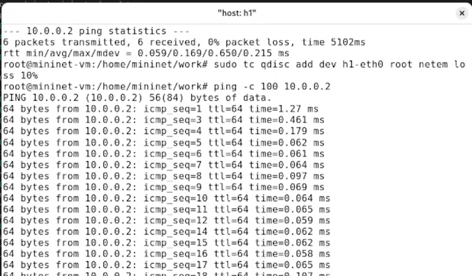{#fig:003 width=70%}

##  Добавление потери пакетов на интерфейс,подключённый к эмулируемой глобальной сети

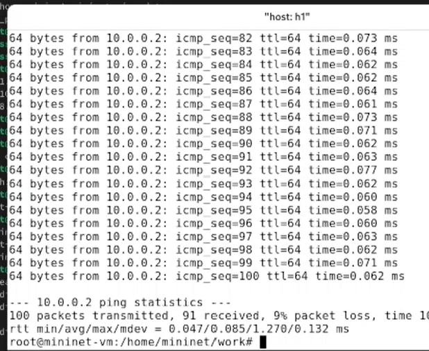{#fig:004 width=70%}

##  Добавление потери пакетов на интерфейс,подключённый к эмулируемой глобальной сети

Для эмуляции глобальной сети с потерей пакетов в обоих направлениях необходимо к соответствующему интерфейсу на хосте h2 также добавить 10% потерь пакетов.
Проверила, что соединение между хостом h1 и хостом h2 имеет больший процент потерянных данных (10% от хоста h1 к хосту h2 и 10% от хоста h2 к хосту h1), повторив команду ping с параметром -c 100 на терминале хоста h1.

##  Добавление потери пакетов на интерфейс,подключённый к эмулируемой глобальной сети

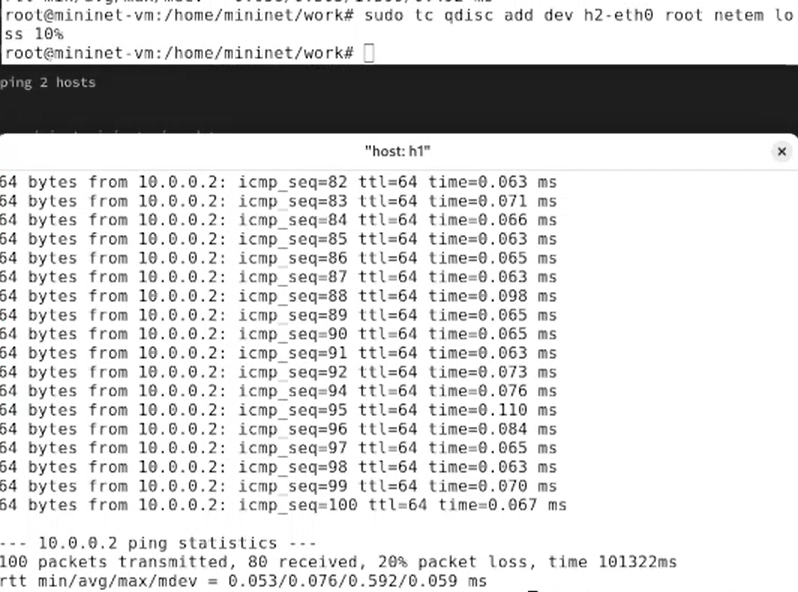{#fig:005 width=70%}

##  Добавление потери пакетов на интерфейс,подключённый к эмулируемой глобальной сети

Восстановила конфигурацию по умолчанию.

{#fig:006 width=70%}

## Добавление значения корреляции для потери пакетов в эмулируемой глобальной сети

Добавила на интерфейсе узла h1 коэффициент потери пакетов 50% (такой высокий уровень потери пакетов маловероятен), и каждая последующая вероятность зависит на 50% от последней:
Проверила, что на соединении от хоста h1 к хосту h2 имеются потери пакетов, используя команду ping с параметром -c 50 с хоста h1.

## Добавление значения корреляции для потери пакетов в эмулируемой глобальной сети

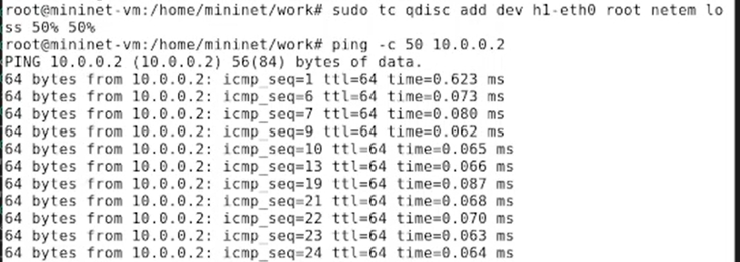{#fig:007 width=70%}

## Добавление значения корреляции для потери пакетов в эмулируемой глобальной сети

{#fig:008 width=70%}

##  Добавление повреждения пакетов в эмулируемой глобальной сети

Добавила на интерфейсе узла h1 0,01% повреждения пакетов.
Проверила конфигурацию с помощью инструмента iPerf3 для проверки
повторных передач.

##  Добавление повреждения пакетов в эмулируемой глобальной сети

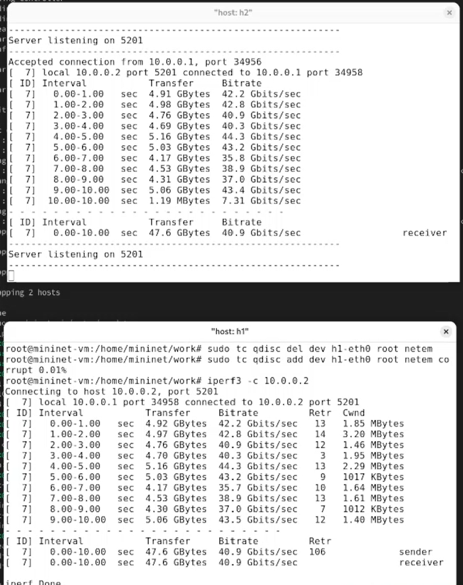{#fig:009 width=70%}

##  Добавление повреждения пакетов в эмулируемой глобальной сети

Значения повторной передачи на каждом временном интервале можно посмотреть в столбце Retr. Например, на 0.00-1.00 интервале retr=13, на следующем 14 и т.д. Всего 106 повторно отправленных пакетов.

## Добавление переупорядочивания пакетов в интерфейс подключения к эмулируемой глобальной сети

Добавим на интерфейсе узла h1 следующее правило: 25% пакетов (со значением корреляции 50%) будут отправлены немедленно, а остальные 75% будут задержаны на 10 мс. Проверим, что на соединении от хоста h1 к хосту h2 имеются потери пакетов,используя команду ping с параметром -c 20 с хоста h1. Убедимся, что часть пакетов не будут иметь задержки (один из четырех, или 25%), а последующие несколько пакетов будут иметь задержку около 10 миллисекунд (три из четырех, или 75%).

## Добавление переупорядочивания пакетов в интерфейс подключения к эмулируемой глобальной сети

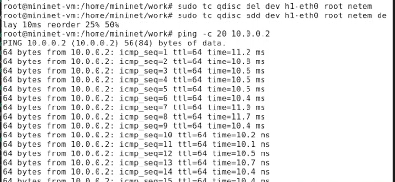{#fig:010 width=70%}

## Добавление переупорядочивания пакетов в интерфейс подключения к эмулируемой глобальной сети

Изменила значение корреляции для более вероятного результата.

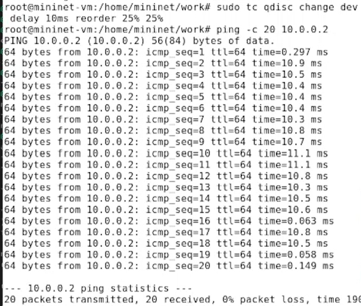{#fig:011 width=70%}

## Добавление дублирования пакетов в интерфейс подключения к эмулируемой глобальной сети

Для интерфейса узла h1 зададим правило c дублированием 50% пакетов (т.е. 50% пакетов должны быть получены дважды):
Проверим, что на соединении от хоста h1 к хосту h2 имеются дублированные пакеты, используя команду ping с параметром -c 20 с хоста h1. Дубликаты пакетов помечаются как DUP!.

## Добавление дублирования пакетов в интерфейс подключения к эмулируемой глобальной сети

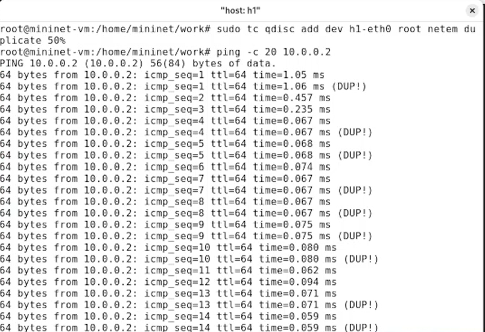{#fig:012 width=70%}

# Воспроизводимые эксперименты

## Добавление потери пакетов

В виртуальной среде mininet в своём рабочем каталоге с проектами создадим каталог simple-drop и перейдем в него.
Создадим скрипт для эксперимента lab_netem_ii.py.

{#fig:013 width=70%}

## Добавление потери пакетов

Скорректировала скрипт так, чтобы на экран или в отдельный файл выводилась информация о потерях пакетов.

## Добавление потери пакетов

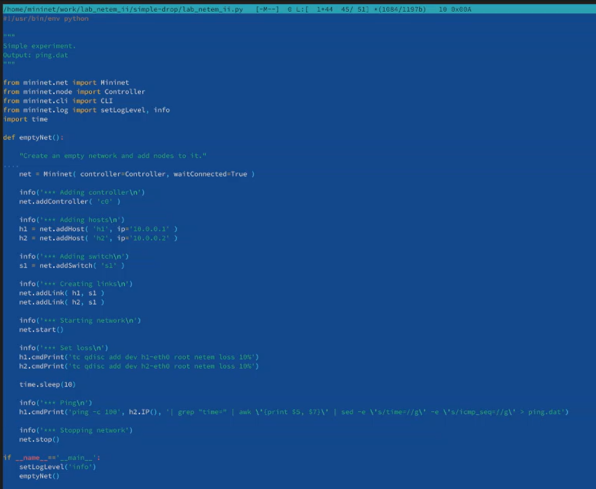{#fig:014 width=70%}

## Добавление потери пакетов

{#fig:015 width=70%}

## Добавление потери пакетов

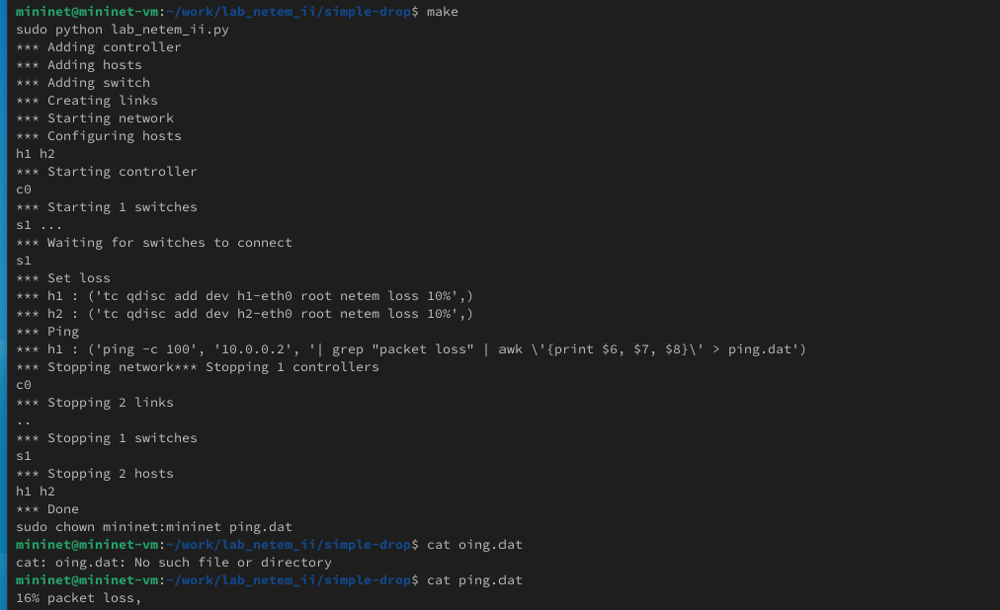{#fig:016 width=70%}

## Добавление значения корреляции

{#fig:017 width=70%}

## Добавление значения корреляции

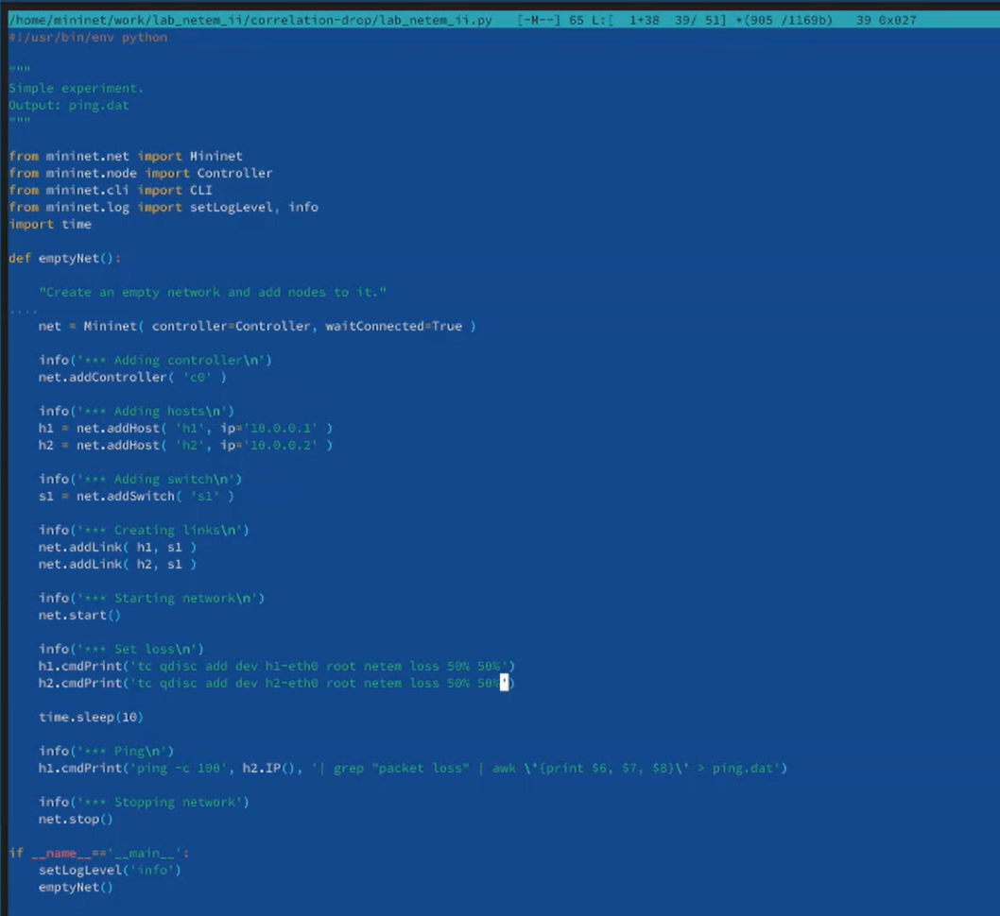{#fig:018 width=70%}

## Добавление значения корреляции

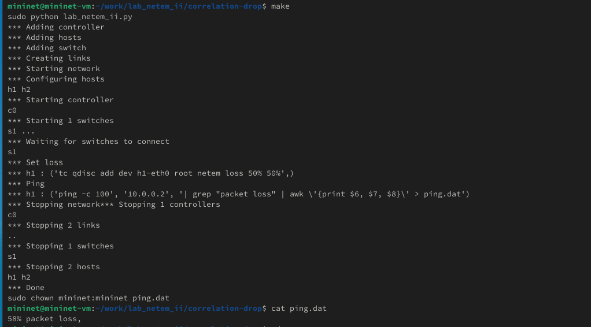{#fig:019 width=70%}

## Добавление повреждения пакетов

{#fig:020 width=70%}

## Добавление повреждения пакетов

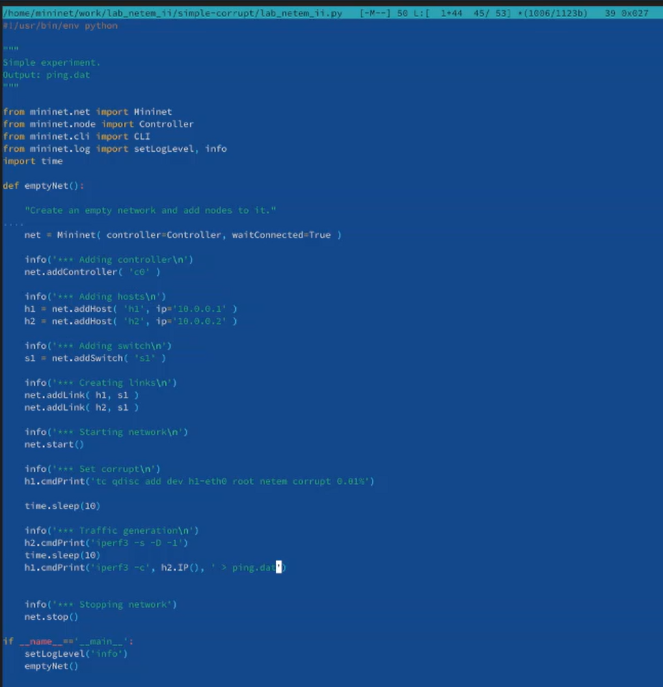{#fig:021 width=70%}

## Добавление повреждения пакетов

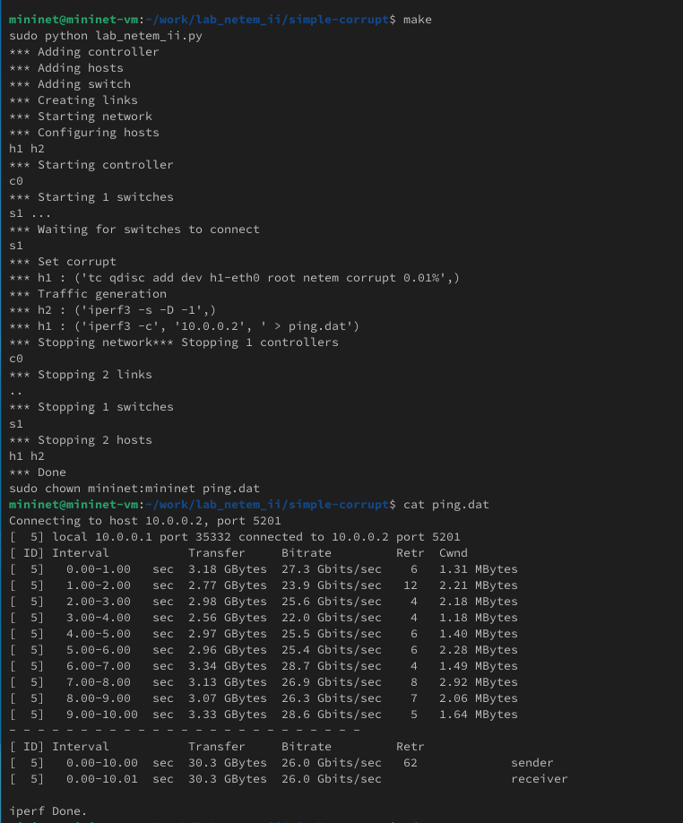{#fig:022 width=70%}

## Добавление переупорядочивания пакетов

{#fig:023 width=70%}

## Добавление переупорядочивания пакетов

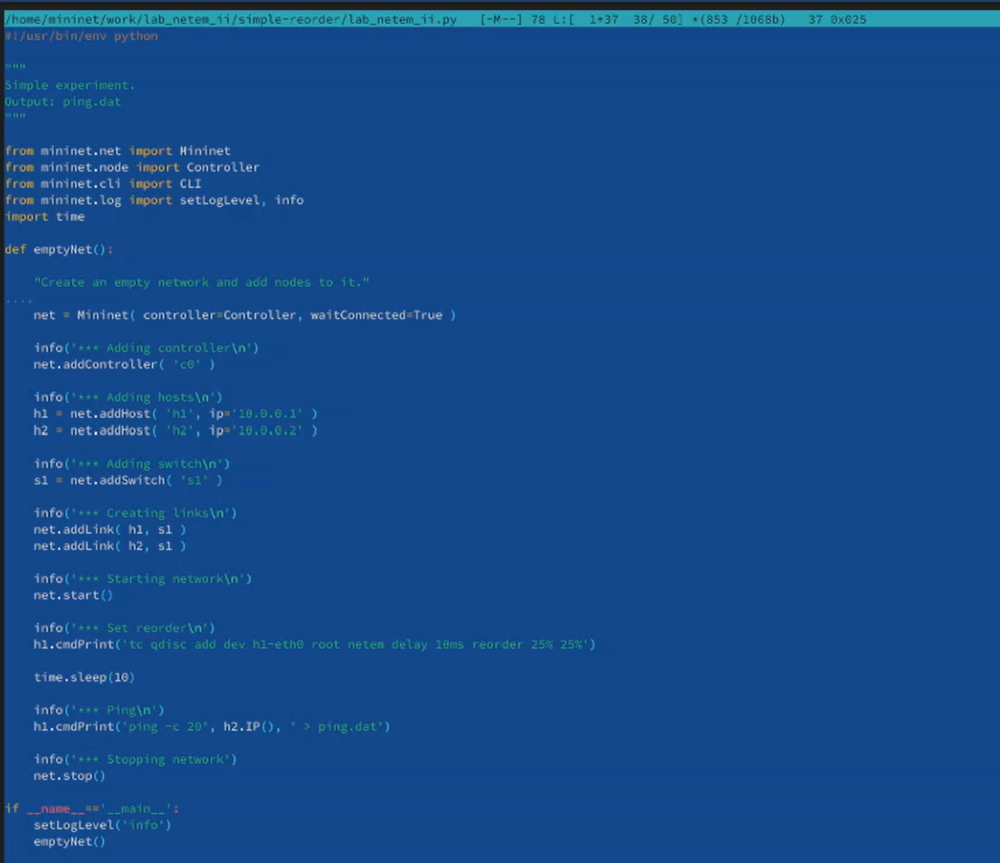{#fig:024 width=70%}

## Добавление переупорядочивания пакетов

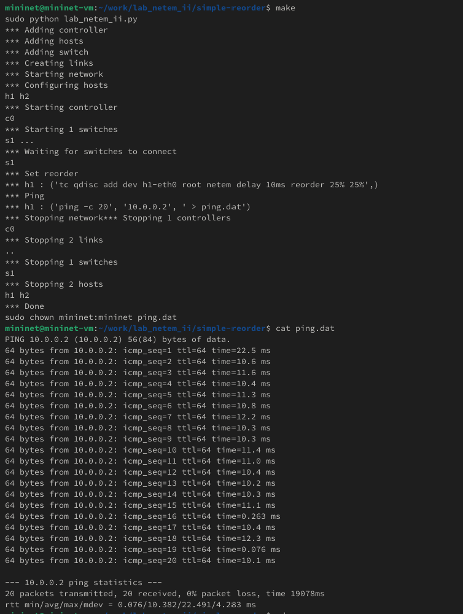{#fig:025 width=70%}

## Добавление дублирования пакетов

{#fig:026 width=70%}

## Добавление дублирования пакетов

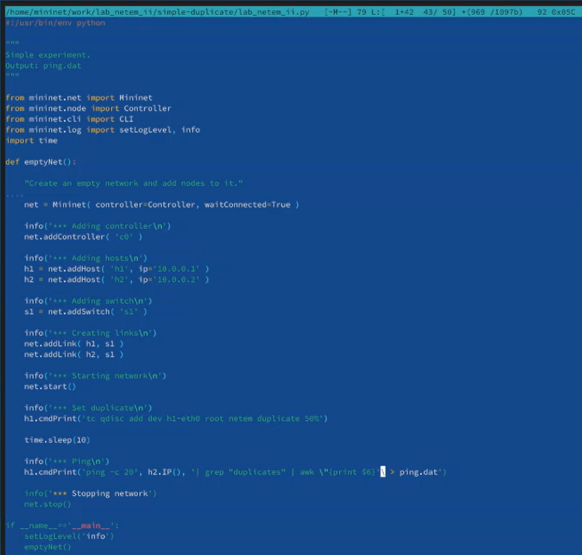{#fig:027 width=70%}

## Добавление дублирования пакетов

{#fig:028 width=70%}

## Выводы

В процессе выполнения лабораторной работы я получила навыки проведения интерактивных экспериментов в среде Mininet по исследованию параметров сети, связанных с потерей, дублированием, изменением порядка и повреждением пакетов при передаче данных. Эти параметры влияют на производительность протоколов и сетей.